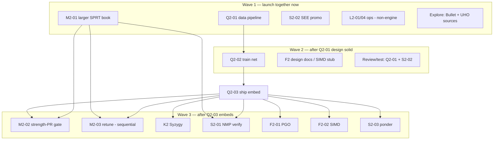

# Phase 2 Engine Improvements Plan

> **Status:** Planning only (2026-07-14). Do not treat this as a substitute for the living task board.
> **Canonical tasks / checkboxes:** [tasks.md](./tasks.md)
> **Phase 1 archive (already shipped):** [tasks-phase1.md](./tasks-phase1.md)
> **Module ownership:** [ARCHITECTURE.md](../ARCHITECTURE.md) · conventions: [AGENTS.md](../AGENTS.md)
>
> **Audience:** humans and Cursor agents coordinating parallel Elo work on OpenChess.
> **Paradigm unchanged:** Stockfish-family bitboards + PVS + selective search + incremental NNUE + Lazy SMP + SPRT.

---

## 1. Scope: engine vs infra/ops

Phase 2 = **measure-and-raise Elo (trained NNUE + SPRT)** while making Lichess production-safe. This plan focuses on **engine improvements**; Lichess is adjacent coordination, not core Elo machinery.

| Pillar | Engine improvement? | Role |
|---|---|---|
| **Q2 Trained eval** | **Yes — primary Elo lever** | Replace material-distilled bootstrap with Bullet-trained net |
| **M2 Measurement** | **Yes (process) + harness** | Larger openings, strength-PR discipline, post-net margin retune |
| **K2 Endgame** | **Yes** | Syzygy WDL/DTZ (Phase 1 **P8-02** carry-forward) |
| **S2 Search polish** | **Yes** | NMP verification, SEE promo recaptures, optional ponder |
| **F2 Throughput** | **Yes (NPS, not semantics)** | PGO + SIMD NNUE forward (Phase 1 **P8-04** carry-forward) |
| **L2 Lichess go-live** | **No — ops / product** | Smoke, config, rated gate, concurrency; must not rewrite search |

### Engine workstreams ranked (dependency → Elo impact)

| Rank | Workstream | Deps | Expected Elo / value | Why this order |
|---|---|---|---|---|
| 1 | **Q2** Trained NNUE | none → Q2-01 → 02 → 03 | **Largest** (leaf quality ceiling; research: chesswiki Phase C–D, reckless §7, stockfish NNUE) | Everything else retunes against the wrong leaf until this lands |
| 2 | **M2-01/02** Measurement harness | none for book; M2-02 after Q2-03 | Enables trustworthy claims | Without UHO-scale openings + OwnBook=false, “Elo” is noise ([chesswiki §7](./chesswiki.md#7-scientific-development-non-negotiable-for-strength), [testing/README.md](../testing/README.md)) |
| 3 | **M2-03** Post-net margin retune | Q2-03, M2-01 | **High** (Phase 1 constants were for bootstrap) | “Copy structure, not constants” ([tasks.md](./tasks.md), chesswiki Selectivity) |
| 4 | **K2** Syzygy | Prefer Q2-03 + M2-01 for Elo claims | ~“10 Elo class” when available ([reckless §8](./reckless.md#8-endgame-tablebases)) | Perfect conversion; skips heavy probes in qsearch |
| 5 | **S2-01** NMP verification | Q2-03, M2-01 | Small–medium / stability | Phase 1 NMP has no verification ([tasks-phase1.md](./tasks-phase1.md) P5-01 Note) |
| 6 | **S2-02** SEE promo recaptures | none | Correctness → ordering/prune safety | First-move promo modeled; recaptures not ([src/board/see.rs](../src/board/see.rs)) |
| 7 | **F2** PGO + SIMD | Q2-03 (stable net shape) | Depth via NPS, not new knowledge | Scalar forward only today ([src/eval/nnue/forward.rs](../src/eval/nnue/forward.rs)); no `simd/` yet |
| 8 | **S2-03** Optional ponder | Q2-03 | Clock-time depth in GUIs; Lichess stays off | Product surface ([stockfish.md](./stockfish.md) UCI `Ponder`) |

**Out of scope for this plan (do not re-plan):** Phase 1 P1–P7, P8-01 Lazy SMP, P8-03 harness skeleton, P9 CLI skeleton, P10 book, P11 arena. Speculative tracks in [uniqueideas.md](./uniqueideas.md). Chess.com strength path.

---

## 2. Current state (engine snapshot)

OpenChess today is a **complete Phase 1 Stockfish-family skeleton** with a **bootstrap NNUE**, not a trained leaf.

| Area | What exists | Phase 2 gap |
|---|---|---|
| **Board** | Bitboards + mailbox, magics, make/unmake, legal movegen, Zobrist, pins/checkers, SEE, perft | SEE: first-move promotion bonus yes; **later recapture promotions no** (S2-02) |
| **Search** | ID, PVS Root/PV/NonPV, aspiration, qsearch, stack/PV | Full |
| **Ordering** | Staged MovePicker, killers, quiet/capture/continuation/pawn history | Stable |
| **Selectivity** | Improving, NMP, LMR, RFP, razoring, LMP/futility/history/SEE prune, ProbCut, IIR, singular/multi-cut | **NMP has no verification re-search** (S2-01); margins tuned for bootstrap |
| **TT** | Clustered, bounds, age, mate ply adjust, prefetch, Lazy SMP racy shared | Full |
| **Eval** | HCE material+PST; HalfKA NNUE L1=256, L2=L3=32; `OCNNv002` load; post-corrections | Leaf is **`Network::build_bootstrap()` material-distilled** until Q2; no training pipeline under `tools/` |
| **SMP / time / UCI** | Lazy SMP (`threadpool`), soft/hard TM, `Hash`/`Threads`/`EvalFile`/`OwnBook`… | No `Ponder`, no `SyzygyPath`; no `parameters.rs` yet (ARCHITECTURE sketch) |
| **TB / SIMD / PGO** | Absent (`tb.rs` not in tree; no Cargo `syzygy` feature; scalar forward only) | K2 + F2 |
| **Measurement** | `testing/sprt.sh`, ~20-line smoke `openings.epd`, OpenBench sketch, CONTRIBUTING strength-PR rule | M2: grow book; tighten post-net gates |
| **Lichess / arena / book** | CLI + arena + Polyglot/repertoire shipped | L2 ops only (not this plan’s core) |

**Critical path from [tasks.md](./tasks.md):** trained net → scaled SPRT → one-at-a-time retune/TB/search polish → throughput → rated Lichess gate.

---

## 3. Workstreams (agent-sized)

Each workstream maps to task IDs agents can own exclusively. Launch **one primary implementer agent per stream**; pair with review/test agents where noted.

### W1 — Q2 Trained eval (critical path)

| | |
|---|---|
| **Tasks** | Q2-01 → Q2-02 → Q2-03 |
| **Goal** | Ship a Bullet-trained (or agreed) successor to the material bootstrap; default embed as `OCNNv00x`; `EvalFile` still overrides |
| **Acceptance** | Fixture/repro pipeline builds; startpos + tactical smoke; beats bootstrap on fixed-node bench **or** local SPRT; fresh release plays trained net without flags |
| **Key files** | `src/eval/nnue/{network,forward,accumulator,features}.rs`, `src/uci.rs` (`EvalFile`), new `tools/` or `research/` training docs + data scripts; possibly new embedded bytes |
| **Deps** | None to start Q2-01; Q2-02 needs Q2-01; Q2-03 needs Q2-02 |
| **Research** | [chesswiki §3 / Phase C–D](./chesswiki.md#3-evaluation) · [reckless §7 / §7.5 Bullet](./reckless.md#7-nnue-evaluation-why-stockfish-works-so-well) · [stockfish §10](./stockfish.md#10-nnue-evaluation-current-master) · tasks Phase 1 P6-06 Note |
| **Agent hints** | Prefer a long-context / thorough implementer for Q2-01 design. Shell agent for training runs. **Freeze `OCNNv002` layout** before F2 SIMD; if topology changes, bump magic and coordinate with F2 |
| **Sequential vs parallel** | Pipeline is **sequential** (data → train → ship). Parallelizable slices: data-format doc vs small fixture generator vs load-path unit tests; **not** parallel train-two-architectures into default embed |

### W2 — M2 Measurement

| | |
|---|---|
| **Tasks** | M2-01, M2-02, M2-03 |
| **Goal** | Strength science: UHO/8moves-class openings; CONTRIBUTING post-net PR gates; retune P5 margins **one SPRT at a time** |
| **Acceptance** | `sprt.sh` runs new book with `OwnBook=false`; CONTRIBUTING matches practice; ≥1 accepted SPRT win for a retune noted on the board |
| **Key files** | `testing/books/`, `testing/sprt.sh`, `testing/README.md`, `CONTRIBUTING.md`; retune touches `src/search/selectivity.rs` (+ any future `parameters.rs`) |
| **Deps** | M2-01 none; M2-02/03 need Q2-03 + M2-01 |
| **Research** | [chesswiki §7 / Phase D](./chesswiki.md#7-scientific-development-non-negotiable-for-strength) · [openings.md](./openings.md) SPRT-vs-play · stockfish Fishtest practice |
| **Agent hints** | Book prep is **explore/shell**-friendly (download/wire EPD). Retune implementer must not stack patches. Adversarial: second agent runs/reviews SPRT logs |
| **Sequential vs parallel** | M2-01 || Q2 entirely. **M2-03 retunes are strictly sequential with each other.** Prefer not overlapping M2-03 with S2-01 on the same machine calendar without clear baseline tags |

### W3 — K2 Syzygy

| | |
|---|---|
| **Tasks** | K2-01 |
| **Goal** | WDL in search; DTZ at root; UCI `SyzygyPath`; skip heavy probes in qsearch; Cargo feature `syzygy` |
| **Acceptance** | Known 5-man wins → TB scores/mate bounds; root prefers DTZ progress |
| **Key files** | **New** `src/tb.rs` (or `src/syzygy/`), `Cargo.toml` feature, probe hooks in `src/search/alphabeta.rs` / root in `src/search/mod.rs`, `src/uci.rs` option — **do not** invent margins in selectivity |
| **Deps** | Prefer M2-01 + Q2-03 before Elo claim; code can spike earlier behind feature flag |
| **Research** | chesswiki Syzygy · reckless `tb.rs` / Fathom · stockfish `syzygy/` · Phase 1 P8-02 |
| **Agent hints** | Isolate C/FFI + feature flag early so merge is optional for default CI. Review agent for probe-in-qsearch footguns |
| **Sequential vs parallel** | Implementation || F2 and L2; **SPRT vs baseline alone** (no concurrent strength patch) |

### W4 — S2 Search polish (three slices)

Treat as **three ownership slices** that can use separate agents when deps allow.

#### W4a — S2-02 SEE promo recaptures (unblock early)

| | |
|---|---|
| **Goal** | Model promotion on recapture swaps in SEE |
| **Acceptance** | Fixture set: winning/losing promo-recapture signs |
| **Files** | `src/board/see.rs` (+ tests) only |
| **Deps** | none — **Wave 1** |
| **Parallel-ok** | Q2, M2-01, L2, F2 design |

#### W4b — S2-01 NMP verification (post-net)

| | |
|---|---|
| **Goal** | Verification re-search behind NMP fail-high; feature toggle |
| **Acceptance** | Toggleable; SPRT or fixed-node smoke documents node/Elo effect |
| **Files** | `src/search/selectivity.rs` (NMP path); maybe thin hooks in `alphabeta.rs` |
| **Deps** | Q2-03, M2-01 |
| **Do not** | Combine with an M2-03 margin change in the same PR |

#### W4c — S2-03 Optional ponder

| | |
|---|---|
| **Goal** | UCI `Ponder` + legal `ponderhit`; **off** for Lichess daemon |
| **Acceptance** | GUI ponderhit plays legal move; Lichess path remaining ponder-off |
| **Files** | `src/uci.rs`, search stop/start in `search/mod.rs` / `threadpool.rs`; Lichess only docs/default — avoid fighting L2 ownership of `src/lichess/` |
| **Deps** | Q2-03 preferred |

### W5 — F2 Throughput

| | |
|---|---|
| **Tasks** | F2-01 PGO, F2-02 SIMD NNUE |
| **Goal** | Raise NPS without changing chess semantics |
| **Acceptance** | Documented PGO release profile + measurable NPS; SIMD bit-exact vs scalar fixtures + bench NPS uplift |
| **Key files** | Docs/`scripts`/Makefile or Cargo notes (F2-01); `src/eval/nnue/forward.rs` + **new** `src/eval/nnue/simd/` (F2-02). Architecture already sketches `simd/` |
| **Deps** | Q2-03 (stable weights/topology) |
| **Research** | reckless simd / release profile · stockfish Makefile PGO · Phase 1 P8-04 |
| **Agent hints** | F2-01 (docs/shell) || F2-02 (eval SIMD). Soften architecture churn during SIMD: **Q2 must not change L1/format mid-F2** |
| **Sequential vs parallel** | F2-01 || F2-02; both || K2 and L2 docs; **not** parallel with Q2 architecture churn |

### Non-engine (coordinate only): L2

Keep L2 agents on `src/lichess/`, ops docs, config — **no** search/eval training. Rated gate L2-06 depends on Q2-03 + M2-02. Useful as a **parallel utilization sink** while Q2 trains.

---

## 4. Multi-agent efficiency strategy

### 4.1 Ownership boundaries (anti-collision)

| Agent owns | Primary paths | Hard avoid |
|---|---|---|
| **Q2** | `src/eval/nnue/**`, training `tools/`/`research/` training notes, embed bytes | `search/selectivity.rs` margins, `testing/books/` |
| **M2 book/docs** | `testing/**`, `CONTRIBUTING.md` strength sections | Net topology, `board/see.rs` |
| **M2 retune** | `search/selectivity.rs` constants / future `parameters.rs` | Net files, `tb.rs`, SEE |
| **K2** | `tb.rs` / `syzygy/`, Cargo feature, UCI `SyzygyPath`, search **probe call sites only** | NNUE weights, LMR tables |
| **S2-02** | `board/see.rs` | selectivity, nnue |
| **S2-01** | `search/selectivity.rs` NMP | see.rs, network.rs |
| **S2-03** | `uci.rs` ponder + session/search stop API | lichess policy (notify L2) |
| **F2** | build scripts + `eval/nnue/simd/` + `forward.rs` dispatch | selectivity, book, lichess |
| **L2** | `src/lichess/**`, Lichess README/ops | search, eval |

**Rule (from tasks.md):** one pillar’s contract/API change requires updating that pillar’s Contract on the board and notifying the owning agent.

**Merge rule:** never merge two strength-affecting PRs without a known baseline commit between them after Q2-03.

### 4.2 Shared conventions

| Convention | Recommendation |
|---|---|
| **Branches** | `phase2/q2-01-data-pipeline`, `phase2/m2-01-uho-book`, `phase2/s2-02-see-promo`, `phase2/k2-syzygy`, `phase2/f2-simd-nnue`, … |
| **PR size** | One task ID per PR when possible; strength PRs must not bundle Q2+S2+K2 |
| **Task board** | Flip checkboxes in [tasks.md](./tasks.md); link PR in the Note |
| **CI before claim** | `./scripts/ci.sh`; strength: `./testing/sprt.sh` per [CONTRIBUTING.md](../CONTRIBUTING.md) |
| **Book policy** | SPRT: `OwnBook=false` + EPD seed; play/Lichess: OwnBook on ([testing/README.md](../testing/README.md), openings.md) |
| **SPRT defaults** | Elo0=0, Elo1=5, α=β=0.05 ([testing/README.md](../testing/README.md)) |
| **Net format** | Keep `OCNNv002` unless Q2 explicitly versions; announce breaking magic before F2 |
| **Features** | `syzygy` optional; default CI remains no-TB |

### 4.3 Wave schedule (maximize parallelism)

#### Wave 1 — **max parallel now** (5+ agents)

| Slot | Focus | Agent type |
|---|---|---|
| A | **Q2-01** training data pipeline design + fixture | Implementer (thorough) |
| B | **M2-01** wire larger EPD / UHO into `sprt.sh` | Shell + light docs |
| C | **S2-02** SEE promo recaptures + fixtures | Focused implementer |
| D | **L2** operator docs / config (non-engine utilization) | Implementer on `lichess/` |
| E | **Explore** Bullet workflow + UHO/8moves book provenance | `explore` (readonly) |
| Optional F | **cursor-guide** / process only if needed | — |

No shared file collisions if roles follow §4.1.

#### Wave 2 — train + validate (3–4 agents)

| Slot | Focus | Agent type |
|---|---|---|
| A | **Q2-02** train + load via `EvalFile` / candidate embed | Implementer + **shell** for train jobs |
| B | Design **F2** SIMD/PGO docs only (no hot-path rewrite yet) | Docs / light scaffold |
| C | **Review** Q2-01 + S2-02 PRs | `bugbot` / security-review only if asked; else adversarial test agent running `ci.sh` + SEE fixtures |
| D | Continue M2-01 polish if book not merged | |

**Stays sequential:** cannot honestly SPRT margin retunes against bootstrap and then again against trained net without re-baselining — prioritize getting Q2-03 in.

#### Wave 3 — post-net fan-out (careful strength discipline)

Launch in parallel **only** streams that do not each claim Elo without isolated SPRT:

| Parallel OK together | Sequenced (one active strength experiment) |
|---|---|
| K2 implementation behind feature | **M2-03** single margin family per SPRT |
| F2-01 PGO docs/build | **S2-01** NMP verification SPRT vs clear baseline |
| F2-02 SIMD (correctness first; Elo via NPS under TC) | Do **not** merge two selectivity changes same week without reject |
| S2-03 ponder (off by default) | |
| L2-05/06 prep / concurrent games | |
| M2-02 CONTRIBUTING text | |

**Adversarial / coverage parallelism (every wave):**

1. **Implementer** lands the task.
2. **Test/review agent** runs `./scripts/ci.sh`, relevant unit fixtures, and (for strength) starts `./testing/sprt.sh` against `main` or tagged baseline.
3. **ci-investigator** only when a PR check fails — do not pre-spin.
4. **Explore** agents gather research citations; they do not edit `src/`.

### 4.4 What must stay sequential

1. **Q2-01 → Q2-02 → Q2-03** (data → weights → default embed).
2. **Net format / L1 topology freeze** before serious F2-02 work.
3. **After Q2-03:** one functional strength change measured at a time (tasks.md rule #4) — includes M2-03 slices and S2-01.
4. **L2-06 rated gate** after Q2-03 + M2-02 evidence.
5. Do not retune P5 against bootstrap then ship trained net without repeating the retune.

### 4.5 How to use specialized Cursor agents

| Subagent | Use in this plan |
|---|---|
| **explore** | Wave 1: Bullet + opening-book sourcing; Wave 3: Reckless/SF Syzygy call-site map |
| **shell** | Training runs, book downloads, PGO profile collect, cutechess SPRT |
| **ci-investigator** | Failing PR CI only |
| **bugbot / security-review** | Only when explicitly requested on a PR (FFI in K2 is a good candidate) |
| **generalPurpose** | Multi-file Q2 or K2 implementation when explore already produced a map |
| **best-of-n-runner** | Optional: try two quantization/export recipes in isolated worktrees for Q2-02 — keep **one** winner to embed |

---

## 5. Risks & open questions

| Risk / question | Impact | Mitigation |
|---|---|---|
| Training data license / provenance (LC0 ODbL vs GPL engine) | Legal / redistrib | Prefer self-play / search-labeled data under clear license; document in Q2-01 ([stockfish.md](./stockfish.md) ODbL note) |
| Bootstrap → trained leaf breaks P5 margins badly | Elo regression or explosion | Fixed-node smoke + SPRT before default embed; then M2-03 |
| Agents collide on `selectivity.rs` / `uci.rs` | Merge hell | Ownership table §4.1; one strength PR at a time |
| `OCNNv002` change mid-SIMD | Rework F2 | Freeze after Q2-02 acceptance; version magic if growing L1 |
| Syzygy FFI / sanitizer / CI size | CI flakes | Feature-gate; optional CI job; no TB download in default `ci.sh` |
| Small smoke book → false SPRT accept | Bad merges | Prioritize M2-01 before trusting Elo claims |
| Ponder + Lichess concurrency | Time forfeits / illegal assumptions | Ponder **off** on Lichess path (S2-03 acceptance) |
| Over-parallelizing M2-03 | Noise | Explicit “one patch on the bench” calendar |
| ARCHITECTURE `parameters.rs` missing | Unclear retune locus | M2-03 either introduce thin `parameters.rs` **or** keep constants in `selectivity.rs` — pick one in the first retune PR |
| Premature optimization (SIMD/PGO before net) | Wasted cycles | Hold F2 implementation until Q2-03 ([AGENTS.md](../AGENTS.md)) |

**Open questions to resolve in Q2-01 / K2 spike:**

1. Exact trainer: Bullet-only vs other exporter into `OCNNv002`?
2. Keep L1=256 or grow toward Reckless/SF-family widths (trade NPS vs Elo)?
3. Syzygy: Fathom submodule vs pure-Rust probe?
4. Private OpenBench vs local cutechess only for Phase 2?
5. What is the documented L2-06 “strength bar” (SPRT length / arena smoke) — M2-02 should write it explicitly.

---

## 6. Success metrics (Phase 2 engine)

Gates should match the task board and existing harness language.

| Gate | Metric | Source |
|---|---|---|
| **Correctness floor** | `./scripts/ci.sh` green (tests + bench signature + UCI smoke) | CONTRIBUTING · P8-00 |
| **Q2 ship** | Trained net default-embedded; `EvalFile` override works; beats bootstrap (fixed-node **or** SPRT) | Q2-02/03 acceptance |
| **SPRT science** | Matches use larger book; `OwnBook=false`; Elo0=0 / Elo1=5 / α=β=0.05 | testing/README · M2-01/02 |
| **Strength PRs** | Functional search/eval/selectivity PRs include bench note **and/or** SPRT paste/link | CONTRIBUTING |
| **Post-net retune** | ≥1 accepted SPRT win documented on M2-03 | tasks.md |
| **K2** | 5-man TB scores/mate bounds; DTZ root ranking; no heavy QS probes | K2-01 |
| **S2-01/02** | Fixtures + toggle/SPRT note as applicable | tasks.md |
| **F2** | Measurable NPS uplift; SIMD == scalar on fixtures | F2-01/02 |
| **Rated Lichess (downstream)** | L2-06 checklist met using Q2+M2 evidence | tasks.md L2-06 |

Elo target for Phase 2 is **not** a fixed CCRL number in-repo; success is **measured accepts** under the local SPRT protocol and a clear path past the Lichess rated gate.

---

## 7. Suggested launch checklist (operators)

**Today (Wave 1):**

1. Spawn Q2-01, M2-01, S2-02 agents + optional L2 docs agent + explore (Bullet/UHO).
2. Branch naming / ownership table posted in the chat or PR template.
3. Mark progress only on [tasks.md](./tasks.md).

**When Q2-01 fixtures pass:** start Q2-02 train (shell-heavy); freeze format discussion for F2.

**When Q2-03 merges:** tag baseline (`v-bootstrap-end` or commit SHA); open Wave 3 fan-out; put M2-03 and S2-01 on a **single-file SPRT queue**.

---

## 8. Research citations (skimmed for this plan)

| Doc | Used for |
|---|---|
| [tasks.md](./tasks.md) | Pillars, deps, parallelism matrix, acceptance |
| [tasks-phase1.md](./tasks-phase1.md) | Shipped stack; P5-01 no NMP verify; P1-08 SEE note; P8-02/04 carry-forward |
| [ARCHITECTURE.md](../ARCHITECTURE.md) | Module map, Lazy SMP, NNUE constraints, `tb`/`simd` sketches |
| [chesswiki.md](./chesswiki.md) | Selectivity catalog, Syzygy, Phase C–D, SPRT discipline |
| [reckless.md](./reckless.md) | Bullet training, SIMD layout, Syzygy via Fathom, NMP+verification |
| [stockfish.md](./stockfish.md) | Network::evaluate shape, Fishtest, Ponder, PGO, ODbL note |
| [openings.md](./openings.md) / [testing/README.md](../testing/README.md) | SPRT vs OwnBook play policy |
| [uniqueideas.md](./uniqueideas.md) | Explicit non-goals |

---

*Plan written 2026-07-14 for Phase 2 engine workstreams and multi-agent scheduling. Implement against [tasks.md](./tasks.md); update this plan only if the board’s critical path changes.*
