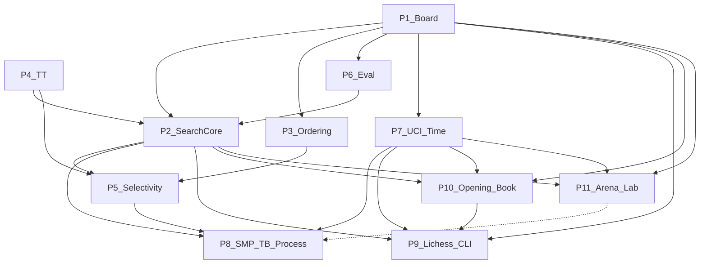

# OpenChess — Engine Pillars & Agent Tasks

> **Audience:** agents implementing OpenChess in parallel.
> **Paradigm:** Stockfish-family (bitboards + PVS + selective search + NNUE + Lazy SMP + SPRT).
> **Research sources:** [chesswiki.md](./chesswiki.md) · [reckless.md](./reckless.md) · [stockfish.md](./stockfish.md) · [LICHESS.md](./LICHESS.md) (P9) · [openings.md](./openings.md) (P10) · [ARENA.md](./ARENA.md) (P11)
> **Out of scope here:** speculative ideas in [uniqueideas.md](./uniqueideas.md) — separate track.
>
> **Implementation language: Rust.** Module layout and ownership: [ARCHITECTURE.md](../ARCHITECTURE.md). Do not treat Stockfish/Reckless magic constants as gospel — copy structure, tune with SPRT.

---

## One-sentence model

**A modern top engine = bitboard board + Lazy SMP alpha-beta (PVS) + aggressive selective search + incremental NNUE eval + shared TT + history heuristics + SPRT testing.**

Search is the coordinator. Board and eval are services. UCI is machine I/O; TUI (`P7b`) is human I/O.

---

## How to use this file (agent rules)

1. **Own one pillar or one task ID at a time.** Do not edit another pillar’s core APIs without updating that pillar’s **Contract** section and notifying the owning agent.
2. **Respect deps.** A task is blocked until every listed dep is marked done (`[x]`).
3. **Acceptance over vibes.** Ship only when the task’s acceptance criteria pass (perft, UCI smoke, fixed-node bench, later SPRT).
4. **One selective-search feature at a time (P5).** Measure before stacking the next.
5. **Copy structure, not constants.** Margins/reductions from Stockfish/Reckless are SPRT-tuned for *their* nets — re-tune.
6. **Mark progress in this file.** Flip `- [ ]` → `- [x]` and note the PR/commit if useful.
7. **Link research.** Each task cites the justifying section; read it before implementing.

### Task entry format

| Field | Meaning |
|---|---|
| **ID** | Stable handle, e.g. `P1-03` |
| **Deps** | Other task IDs that must be done first |
| **Parallel-ok** | Pillars/tasks safe to run concurrently |
| **Deliverable** | APIs / modules expected |
| **Acceptance** | Concrete gate |
| **Research** | Pointer into research docs |

---

## Dependency graph

| Pillar | Owns | Does not own |
|---|---|---|
| **P1 Board** | Types, bitboards/mailbox, attacks/magics, make/unmake, legal movegen, Zobrist, pins/checkers, SEE, perft | Search logic, eval scores |
| **P2 Search core** | Iterative deepening, negamax αβ, PVS node types, aspiration, qsearch, search stack, PV | Pruning recipes (P5), move scoring tables (P3) |
| **P3 Ordering & history** | Staged movepick, TT-move first, MVV-LVA/SEE stages, quiet/noisy/continuation/pawn histories | When to prune (P5) |
| **P4 Transposition table** | Clustered TT, bounds, age/replacement, prefetch API, hashfull | Search control flow |
| **P5 Selectivity** | NMP, RFP, razoring, LMR, LMP, futility, ProbCut, IIR, singular/multi-cut, improving | Base αβ/qsearch (P2) |
| **P6 Evaluation** | HCE bootstrap → NNUE FT/accumulator/forward → post-eval corrections | Move choice |
| **P7 UCI & time** | UCI loop/options, soft/hard stop, time formulas, bench/eval debug cmds | Search internals |
| **P8 Scale & science** | Lazy SMP, optional Syzygy, OpenBench/SPRT, PGO/SIMD polish | Feature invention without measurement |
| **P9 Lichess CLI** | Bot API client, event/game streams, challenge matchmaking, headless daemon | TUI, search internals, UCI subprocess bridge |
| **P10 Opening book** | Book probe, weighted move selection, pre-search hook for TUI/UCI/Lichess; search abort fallback fixes | Search tree, eval training, SPRT opening suite (P8-03 owns EPD file) |
| **P11 Arena lab** | Concurrent local Bot-vs-Bot games, live inspection CLI/TUI, per-slot strength edits, dev batch runs | Formal SPRT (P8-03), online Lichess (P9), single-game TUI (P7b) |

---

## Phased rollout

| Phase | Goal | Unlocks when |
|---|---|---|
| **A — Skeleton** | Play legal chess under UCI | `P1-10`, `P6-01`, `P2-01`, `P7-01` done |
| **B — Scalable search** | Near-minimal tree under the clock | Phase A + `P4-02`, `P3-02`, `P2-03`–`P2-05`, early P5 |
| **C — Eval ceiling** | Leaf quality that rewards depth | Phase B + `P6-05`–`P6-07` |
| **D — Scale & measure** | Elo that is real | Phase C + `P8-01`, `P8-03` |

**Safe to parallelize in Phase A:** P1 (full), P4 API stub (`P4-01`), P6 material (`P6-01`), P7 UCI stub (`P7-01` after `P1-09`).

---

## Parallelism matrix

| Now working on | Can also run |
|---|---|
| P1 Board | P4-01 stub, P6-01 (types only until board exists), docs |
| P1 perft green | P3 API design, P4 full, P6-01/02, P7-01 |
| P2 Search core | P3, P4 (wire as ready), P6 HCE growth, P7 TM |
| P5 Selectivity | P6 NNUE (if search stable), P7 polish — **not** another P5 feature |
| P6 NNUE | P5 (one feature), P8 OpenBench harness prep |
| P8 SMP | Only after single-thread strength is trustworthy |
| P9 Lichess | P7-02, P2-02, P1-09 — parallel with P6/P7 polish; no P9 until search plays legal timed chess |
| P10 Opening book | P2-07 + P10-01 first (stop corner-pawn abort); then P10-02..P10-04 parallel with P6/P7; P10-06 after P9-03 |
| P11 Arena lab | TUI-03, P2-02, P7-02 — parallel with P10/P9; extract shared session from `tui/session.rs` before P11-04 |

---

## P1 — Board

**Contract:** Expose a reversible position: FEN in/out, make/unmake, legal move list, Zobrist key, checkers/pins, SEE. No search or eval policy lives here. Eval may register an observer for incremental updates (NNUE) without owning move application.

**Research:** [chesswiki §1](./chesswiki.md#1-board-representation-the-foundation) · [reckless §5](./reckless.md#5-board-representation-stockfish-family-standard) · [stockfish §8](./stockfish.md#8-board-representation-position)

### Tasks

- [x] **P1-01** — Core types vocabulary  
  - **Deps:** none  
  - **Parallel-ok:** P4-01, P6-01 (score type only), P7 docs  
  - **Deliverable:** `Color`, `Piece`, `PieceType`, `Square`, `Move`, `Bitboard`, `Score`/`Value`, castling rights  
  - **Acceptance:** Types compile; moves encode from/to/promo; no illegal bit widths  
  - **Research:** reckless §3 `types/` · stockfish `types.h`

- [x] **P1-02** — Dual representation: bitboards + mailbox  
  - **Deps:** P1-01  
  - **Parallel-ok:** P4-01, P7-01 (blocked on FEN until P1-09)  
  - **Deliverable:** Position holding piece bitboards, color sets, occupancy, `[Piece; 64]` mailbox  
  - **Acceptance:** Set/clear piece updates both views consistently  
  - **Research:** chesswiki §1 hybrid · reckless §5

- [x] **P1-03** — Attack tables / magic bitboards  
  - **Deps:** P1-01  
  - **Parallel-ok:** P1-02  
  - **Deliverable:** Init-once slider attacks (magics or PEXT); leaper attacks; attack-to helpers  
  - **Acceptance:** Known attack sets for corner/center bishops/rooks/knights match reference  
  - **Research:** chesswiki Bitboards/Magics · stockfish `attacks.*`

- [x] **P1-04** — Make / unmake + state stack  
  - **Deps:** P1-02, P1-03  
  - **Parallel-ok:** P4-01  
  - **Deliverable:** Reversible do/undo storing captured piece, rights, EP, halfmove, hash delta  
  - **Acceptance:** Random walk of make/unmake restores identical board and key  
  - **Research:** chesswiki Make/unmake · reckless `makemove.rs`

- [x] **P1-05** — Move generation (pseudo-legal or legal)  
  - **Deps:** P1-04  
  - **Parallel-ok:** P6-01  
  - **Deliverable:** Generate captures, quiets, evasions; filter illegal or generate legal-only  
  - **Acceptance:** Startpos has 20 legal moves; after `e2e4` has 20  
  - **Research:** chesswiki §1 · stockfish `movegen.*`

- [x] **P1-06** — Incremental Zobrist  
  - **Deps:** P1-04  
  - **Parallel-ok:** P1-05, P4-01  
  - **Deliverable:** Keys for piece×square, side, castling, EP; XOR on make/unmake  
  - **Acceptance:** Full rehash equals incremental key after 1000 random plies  
  - **Research:** chesswiki §4 · stockfish position Zobrist

- [x] **P1-07** — Checkers, pins, threats  
  - **Deps:** P1-05, P1-03  
  - **Parallel-ok:** P1-06, P1-08  
  - **Deliverable:** Incremental or refreshed checkers/pinners/pinned; optional threat map  
  - **Acceptance:** Known check/pin positions classified correctly; king evasion set matches hand cases  
  - **Research:** reckless §5 critical board features · stockfish §8

- [x] **P1-08** — Static Exchange Evaluation (SEE)  
  - **Deps:** P1-03, P1-05  
  - **Parallel-ok:** P1-06, P1-07  
  - **Deliverable:** SEE(move) → material sequence score; used later by P3/P5  
  - **Acceptance:** Textbook winning/losing captures return correct sign on a fixture set  
  - **Research:** chesswiki Move Ordering / SEE · reckless `see.rs`  
  - **Note:** First-move promotion bonus modeled in swap; recapture promotions still unmodeled.

- [x] **P1-09** — FEN + UCI move parsing  
  - **Deps:** P1-04, P1-05  
  - **Parallel-ok:** P1-07, P1-08  
  - **Deliverable:** Parse/set FEN; parse UCI move strings against current position  
  - **Acceptance:** Round-trip startpos FEN; reject illegal UCI moves  
  - **Research:** stockfish `position` FEN · reckless `parser.rs`

- [x] **P1-10** — Perft suite (hard gate)  
  - **Deps:** P1-05, P1-06, P1-07, P1-09  
  - **Parallel-ok:** P3 design, P4 full, P6-01, P7-01  
  - **Deliverable:** `perft(depth)` + standard suite (startpos, Kiwipete, etc.)  
  - **Acceptance:**  
    - startpos `perft(6) = 119060324`  
    - Kiwipete (`r3k2r/p1ppqpb1/bn2pnp1/3PN3/1p2P3/2N2Q1p/PPPBBPPP/R3K2R w KQkq -`) `perft(5) = 193690690`  
    - No illegal moves in sampled dumps  
  - **Research:** chesswiki §7 / Getting Started · stockfish `perft.h`

---

## P2 — Search core

**Contract:** Own the search loop and PV. Call board make/unmake, ask P3 for the next move, probe/store P4, score leaves via P6. Do not embed pruning margins here beyond what P5 will later inject behind clear hooks.

**Research:** [chesswiki §2](./chesswiki.md#2-search--the-engines-brain) · [reckless §6](./reckless.md#6-search-architecture-the-brain) · [stockfish §9](./stockfish.md#9-search-architecture-searchcpp)

### Tasks

- [x] **P2-01** — Negamax alpha-beta + material leaf  
  - **Deps:** P1-10, P6-01  
  - **Parallel-ok:** P3-01, P4-02, P7-02  
  - **Deliverable:** Fail-soft αβ; side-to-move relative scores; root best move  
  - **Acceptance:** From startpos `go depth 4` returns a legal move; no crashes on checks  
  - **Research:** chesswiki Baseline stack · stockfish search progression

- [x] **P2-02** — Iterative deepening  
  - **Deps:** P2-01  
  - **Parallel-ok:** P3-02, P4-02, P7-02  
  - **Deliverable:** Depth 1..N loop; always keep last completed best move; stop between iterations  
  - **Acceptance:** Abort mid-ID still emits prior bestmove; deeper depth can change move  
  - **Research:** reckless §6.1 · chesswiki Iterative deepening

- [x] **P2-03** — Quiescence search  
  - **Deps:** P2-01, P1-08 (SEE helpful), P6-01  
  - **Parallel-ok:** P2-02, P3-02  
  - **Deliverable:** At depth ≤ 0 search captures (optional checks); stand-pat; delta/SEE prune hooks  
  - **Acceptance:** Hanging-queen positions no longer evaluate as quiet wins at shallow depth  
  - **Research:** chesswiki Quiescence · reckless §6.4 · stockfish §9.4  
  - **Note:** QS probes/stores TT at depth 0; in-check uses `MovePicker::evasion`.

- [x] **P2-04** — Search stack + PV table  
  - **Deps:** P2-01  
  - **Parallel-ok:** P2-02, P2-03  
  - **Deliverable:** Per-ply stack (static eval slot, move count, killers hook, PV triangle/array)  
  - **Acceptance:** UCI `info` can print a legal PV of length ≥ depth on quiet positions  
  - **Research:** stockfish `Stack` / `RootMove` · reckless `stack.rs`

- [x] **P2-05** — Aspiration windows  
  - **Deps:** P2-02, P2-04  
  - **Parallel-ok:** P2-06, P3-03  
  - **Deliverable:** Narrow root window around previous score; widen + re-search on fail  
  - **Acceptance:** Stable positions often complete without full-window re-search; fail-high/low still correct  
  - **Research:** reckless §6.1 · stockfish §9.1

- [x] **P2-06** — PVS with Root / PV / NonPV node types  
  - **Deps:** P2-02, P2-03, P3-02, P4-02  
  - **Parallel-ok:** P2-05, P5-01 (after this lands)  
  - **Deliverable:** First move full window; siblings null-window + re-search; node-type specialization  
  - **Acceptance:** Bench node counts drop vs plain αβ at fixed depth without illegal moves; PV preserved  
  - **Research:** reckless §6.2 · stockfish §9.2 · chesswiki PVS

- [x] **P2-07** — Root bestmove when zero ID depths complete  
  - **Deps:** P2-02, P3-03  
  - **Parallel-ok:** P10-01  
  - **Deliverable:** Do not emit `root_moves[0]` as final `bestmove` unless ≥1 full depth iteration finished; on abort use TT move, best history quiet, or development heuristic — not movegen order  
  - **Acceptance:** `go movetime 50` from startpos never returns `a2a3`/`a7a6`; `go movetime 100` still legal; prior completed depth still wins when abort mid-ID  
  - **Research:** [openings.md §1.3–§3 Option C](./openings.md#13-time-abort-fallback--corner-pawns) · chesswiki Time management  
  - **Note:** `search::fallback_root_move` seeds `best` from the TT move else the highest `development_score` legal move; used for both the initial `best` and the empty-PV path. Tested via `zero_depth_abort_avoids_corner_pawn` / `abort_fallback_prefers_tt_move`.

---

## P3 — Ordering & history

**Contract:** Given a position and stage context, yield moves best-first. Own history tables and scoring. Do not decide LMR/LMP cutoffs (P5 reads history scores).

**Research:** [chesswiki Move ordering](./chesswiki.md#2-search--the-engines-brain) · [reckless §6.5](./reckless.md#65-move-ordering-more-important-than-people-think) · [stockfish §9.5](./stockfish.md#95-move-ordering-movepickcpp)

### Tasks

- [x] **P3-01** — Move list + score/pick-best API  
  - **Deps:** P1-05  
  - **Parallel-ok:** P1-10, P4-*, P2-01  
  - **Deliverable:** Scored move list; partial sort / pick-best without full sort requirement  
  - **Acceptance:** Unit test: highest score returned first repeatedly  
  - **Research:** chesswiki “never generate unsorted” · reckless movepick

- [x] **P3-02** — Staged MovePicker  
  - **Deps:** P3-01, P1-08, P4-02 (TT move; stub hash move OK early)  
  - **Parallel-ok:** P2-03, P2-06  
  - **Deliverable:** Stages: TT → good noisy (SEE≥0) → quiets → bad noisy; evasion/qsearch variants  
  - **Acceptance:** In cut-node fixtures, TT/good-capture tried before losing captures  
  - **Research:** reckless §6.5 stages · stockfish `MovePicker` stages  
  - **Note:** `Main` / `Qsearch` / `Evasion` picker kinds landed.

- [x] **P3-03** — Killers + quiet history (butterfly)  
  - **Deps:** P3-02, P2-04  
  - **Parallel-ok:** P2-06, P5-01  
  - **Deliverable:** Killer slots per ply; history updates on quiet cutoffs; history-ordered quiets  
  - **Acceptance:** After a quiet cutoff, same quiet ranks higher on revisit  
  - **Research:** chesswiki History heuristic · stockfish `history.h`  
  - **Note:** Butterfly `[Color][from][to]` with gravity; killers scored inside quiet stage.

- [x] **P3-04** — Capture / continuation / pawn history  
  - **Deps:** P3-03  
  - **Parallel-ok:** P5-02, P5-03  
  - **Deliverable:** Noisy history; continuation (1/2/… ply); optional pawn-structure keyed history  
  - **Acceptance:** Histories update without overflowing; LMR/LMP can read scores (API stable)  
  - **Research:** reckless `history.rs` · stockfish continuation/pawn history  
  - **Note:** Capture + continuation (plies 1/2/4/6) + pawn history; `quiet_score`/`capture_score`/`stat_score` stable for P5.

---

## P4 — Transposition table

**Contract:** Shared cache of bound/score/move/depth keyed by Zobrist. Search owns when to probe/store. Thread-safe enough for Lazy SMP later (racy OK if documented).

**Research:** [chesswiki §4](./chesswiki.md#4-memory--hashing) · [reckless §6.6](./reckless.md#66-transposition-table) · [stockfish §11](./stockfish.md#11-transposition-table-ttcpp--tth)

### Tasks

- [x] **P4-01** — TT API stub + key contract  
  - **Deps:** P1-01 (key type), P1-06 preferred  
  - **Parallel-ok:** all of P1 after types  
  - **Deliverable:** `probe(key) → Option<Entry>`, `store(...)`, `clear`, `new_search` age bump  
  - **Acceptance:** Store then probe same key returns move/depth/bound; wrong key misses  
  - **Research:** chesswiki TT contents

- [x] **P4-02** — Clustered TT + replacement  
  - **Deps:** P4-01, P1-06  
  - **Parallel-ok:** P2-*, P3-02, P7 Hash option  
  - **Deliverable:** Multi-entry clusters; exact/lower/upper; age; depth-preferred replacement; hashfull  
  - **Acceptance:** Fill table; `hashfull` rises; shallower/stale entries replaced under pressure  
  - **Research:** reckless clustered TT · stockfish `tt.cpp`

- [x] **P4-03** — Mate score ply adjust + prefetch hook  
  - **Deps:** P4-02, P2-01  
  - **Parallel-ok:** P2-06, P5-*  
  - **Deliverable:** Mate/TB scores stored relative to root/ply; optional prefetch on make  
  - **Acceptance:** Mate in 3 from root still reports mate in 3 after TT hit at child ply  
  - **Research:** reckless §6.6 · stockfish TT value adjust  
  - **Note:** `value_to_tt`/`value_from_tt` at search probe/store; `tt.prefetch` after make.

---

## P5 — Selectivity

**Contract:** Reduce effective branching factor. Each task adds **one** technique behind flags/hooks in P2. Disable in check / zugzwang where required. Tune later with SPRT — do not cargo-cult margins.

**Research:** [chesswiki Selectivity](./chesswiki.md#2-search--the-engines-brain) · [reckless §6.3](./reckless.md#63-selective-search-catalog-must-know) · [stockfish §9.3](./stockfish.md#93-selective-search-catalog)

### Tasks

- [x] **P5-00** — Improving flag  
  - **Deps:** P2-04, P6-01  
  - **Parallel-ok:** P5-01  
  - **Deliverable:** `improving` when static eval better than ~2 plies ago; exposed to prune/reduce margins  
  - **Acceptance:** Flag true/false on constructed eval sequences  
  - **Research:** reckless/stockfish “improving”  
  - **Note:** `selectivity::is_improving`; wired into αβ before forward-prune hook.

- [x] **P5-01** — Null move pruning (NMP)  
  - **Deps:** P2-06, P3-02, P4-02, P5-00  
  - **Parallel-ok:** P6-03 (not another prune)  
  - **Deliverable:** Null move + reduced search; disable in check / obvious zugzwang; verification as desired  
  - **Acceptance:** Fixed-depth bench nodes drop vs no-NMP; no illegal null in check; tactical suite smoke OK  
  - **Research:** chesswiki NMP · reckless catalog  
  - **Note:** `Board::do_null`/`undo_null`; NonPV scout via `selectivity::try_null_move`; no verification.

- [x] **P5-02** — Late move reductions (LMR)  
  - **Deps:** P5-01, P3-03  
  - **Parallel-ok:** P6-03  
  - **Deliverable:** Reduce late quiet moves; re-search on fail-high; log-depth×log-move style table  
  - **Acceptance:** Node count ↓ at fixed depth; PV move not reduced; re-search path works  
  - **Research:** chesswiki LMR · stockfish move loop  
  - **Note:** log×log table; quiet-only; `LMR_ENABLED` A/B toggle; PVS re-search already wired.

- [x] **P5-03** — Reverse futility (RFP) + razoring  
  - **Deps:** P5-01  
  - **Parallel-ok:** P5-02 (prefer sequential if same agent)  
  - **Deliverable:** RFP fail-high on high eval at low depth; razoring drop to qsearch when very low  
  - **Acceptance:** NonPV-only (or documented); no RFP when in check  
  - **Research:** reckless §6.3 · stockfish steps ~7–9  
  - **Note:** `try_rfp` / `try_razoring` with `RFP_ENABLED` / `RAZORING_ENABLED` toggles.

- [x] **P5-04** — LMP + futility + history/SEE move-loop pruning  
  - **Deps:** P5-02, P3-03, P1-08  
  - **Parallel-ok:** P6-04  
  - **Deliverable:** Skip late quiets (LMP); futility near leaves; history prune; SEE prune losing captures  
  - **Acceptance:** Each sub-flag can toggle; smoke tests pass with all on  
  - **Research:** chesswiki LMP/futility/SEE · reckless move loop  
  - **Note:** `MovePruneCtx` + per-technique toggles; `stat_score` wired into LMR.

- [x] **P5-05** — ProbCut + IIR  
  - **Deps:** P5-04, P3-02  
  - **Parallel-ok:** P6-05  
  - **Deliverable:** ProbCut shallow capture proof; IIR when no TT move  
  - **Acceptance:** Triggers on fixtures; no search explosion; TT miss path reduces as designed  
  - **Research:** stockfish ProbCut / IIR · reckless catalog  
  - **Note:** `try_probcut` + `apply_iir`; NonPV-only IIR depth−1 when no TT hit.

- [x] **P5-06** — Singular extensions + multi-cut + negative extensions  
  - **Deps:** P5-05, P4-02  
  - **Parallel-ok:** P6-06, P8-03 harness  
  - **Deliverable:** TT move singular → extend; multi-cut prune; negative reduce when non-singular  
  - **Acceptance:** Extension counts visible in debug; no illegal depths; fixed-node smoke stable  
  - **Research:** reckless singular/multi-cut · stockfish step ~15  
  - **Note:** `excluded` move on `search`; `try_singular`; counters on `ThreadData`.

---

## P6 — Evaluation

**Contract:** Return a side-to-move-relative score. NNUE is an **eval, not a policy** — it does not suggest moves. Board notifies observers on make/unmake for incremental FT updates.

**Research:** [chesswiki §3](./chesswiki.md#3-evaluation) · [reckless §7](./reckless.md#7-nnue-evaluation-why-stockfish-works-so-well) · [stockfish §10](./stockfish.md#10-nnue-evaluation-current-master)

### Tasks

- [x] **P6-01** — Material evaluation  
  - **Deps:** P1-02  
  - **Parallel-ok:** P1-05..P1-10, P7-01  
  - **Deliverable:** Sum piece values; STM-relative  
  - **Acceptance:** Startpos = 0; remove white queen → large negative for White to move  
  - **Research:** chesswiki HCE material

- [x] **P6-02** — Piece-square tables (PSTs)  
  - **Deps:** P6-01  
  - **Parallel-ok:** P2-01  
  - **Deliverable:** Midgame PSTs added to material  
  - **Acceptance:** Knight on rim < knight on center all else equal  
  - **Research:** chesswiki PSTs  
  - **Note:** Midgame-only in `eval/pst.rs`; tapering done in P6-03.

- [x] **P6-03** — Tapered HCE extras (optional growth)  
  - **Deps:** P6-02  
  - **Parallel-ok:** P5-*, P2-*  
  - **Deliverable:** Phase interpolate MG/EG; basic pawn structure / king safety as needed  
  - **Acceptance:** Phase 0 and phase 24 endpoints differ sensibly; no search crashes  
  - **Research:** chesswiki HCE terms · Phase C in chesswiki §8  
  - **Note:** EG PSTs + non-pawn phase 0..24 taper in `pst.rs`/`hce.rs`; no pawn/king-safety extras yet.

- [x] **P6-04** — Board observer hooks for incremental eval  
  - **Deps:** P1-04, P6-01  
  - **Parallel-ok:** P6-05 design  
  - **Deliverable:** Observer callbacks on piece add/remove/move for accumulator dirty tracking  
  - **Acceptance:** Make/unmake notifies matching feature deltas in a mock observer  
  - **Research:** reckless `BoardObserver` · stockfish dirty features  
  - **Note:** `on_add`/`on_remove` mid-update; `on_make`/`on_unmake` bookends; covers quiet/capture/promo/EP/castle.

- [x] **P6-05** — NNUE feature transformer + accumulator  
  - **Deps:** P6-04, P1-10  
  - **Parallel-ok:** P5-05, P8-03  
  - **Deliverable:** Sparse king-relative (or chosen) features; dual accumulators; incremental update + refresh  
  - **Acceptance:** Incremental accumulator matches full refresh after random games  
  - **Research:** reckless §7.1–7.3 · stockfish §10.1–10.4 · chesswiki NNUE  
  - **Note:** HalfKA dual accumulators L1=256 in `eval/nnue/`; search uses `make_observed`; production leaf is NNUE.

- [x] **P6-06** — NNUE forward (quantized) + embed/load net  
  - **Deps:** P6-05  
  - **Parallel-ok:** P5-06, P7 EvalFile option  
  - **Deliverable:** FT → small MLP → scalar; load embedded or file weights; SIMD optional later  
  - **Acceptance:** `eval` on startpos finite/stable; same position → same score; NPS still usable vs HCE  
  - **Research:** reckless §7.2 · stockfish Network::evaluate  
  - **Note:** Dense head + FT in `OCNNv002`; UCI `EvalFile`; search leaf is NNUE bootstrap (material-distilled) until Bullet-trained nets.

- [x] **P6-07** — Post-NNUE corrections  
  - **Deps:** P6-06, P3-04 (correction history tables may live with history)  
  - **Parallel-ok:** P8-01  
  - **Deliverable:** Material/optimism scaling, 50-move dampening, correction history residual; clamp vs mate range  
  - **Acceptance:** Raw net ≠ final eval when corrections active; mate scores not clobbered  
  - **Research:** reckless §7.4 · stockfish `evaluate.cpp`  
  - **Note:** `eval/corrections.rs` material+optimism+50-move+mate clamp + pawn/non-pawn correction history residual.

---

## P7 — UCI & time management

**Contract:** stdin/stdout protocol only. Translate `position`/`go` into engine calls; enforce soft/hard stop. Do not implement search inside the UCI file.

**Research:** [chesswiki §6](./chesswiki.md#6-protocols--product-surface) · [reckless §9](./reckless.md#9-time-management--uci) · [stockfish §13](./stockfish.md#13-time-management-timemancpp) · [stockfish §15](./stockfish.md#15-uci-surface-high-signal-options)

### Tasks

- [x] **P7-01** — Minimal UCI loop  
  - **Deps:** P1-09  
  - **Parallel-ok:** P1-10, P2-01, P6-01  
  - **Deliverable:** `uci`, `isready`, `ucinewgame`, `position`, `go`, `stop`, `quit` → `bestmove`  
  - **Acceptance:** Speaks UCI with a GUI or `cutechess`; `go depth 1` returns legal bestmove  
  - **Research:** chesswiki UCI · stockfish uci loop

- [x] **P7-02** — Time management soft/hard  
  - **Deps:** P7-01, P2-02  
  - **Parallel-ok:** P2-05, P4-02  
  - **Deliverable:** Parse `wtime/btime/winc/binc/movestogo`; soft ≈ `remaining/20 + inc/2`; hard abort; Move Overhead  
  - **Acceptance:** `go wtime 5000 winc 50` stops before hard limit; never exceeds hard by more than overhead slack  
  - **Research:** chesswiki Time management · stockfish timeman · reckless soft/hard  
  - **Note:** `time::TimeBudget`; soft between ID depths; hard sets stop; overhead default 50ms.

- [x] **P7-03** — UCI options + debug helpers  
  - **Deps:** P7-01, P4-02  
  - **Parallel-ok:** P6-06, P8-01  
  - **Deliverable:** `Hash`, `Threads` (stub until P8), `Move Overhead`; `bench` / `perft` / `eval` / `d`  
  - **Acceptance:** `setoption name Hash value 64` resizes TT; `bench` prints nodes  
  - **Research:** reckless UCI options table · stockfish §15  
  - **Note:** `Threads` Lazy SMP (max 512); `Move Overhead` session option; `hashfull` in info; `EvalFile` loads NNUE for search.

- [x] **P7-04** — Adaptive TM (stability)  
  - **Deps:** P7-02, P2-05  
  - **Parallel-ok:** P5-*, P8-*  
  - **Deliverable:** Spend more on best-move changes / eval swings; less when stable  
  - **Acceptance:** Volatile roots use more of optimum than dead-drawn roots in logging  
  - **Research:** stockfish fallingEval / bestMoveChanges · reckless TM  
  - **Note:** `IdStability` + `soft_scale(falling×instability)`; hard limit unchanged.

- [x] **P7-05** — Movetime floor clamp  
  - **Deps:** P7-02  
  - **Parallel-ok:** P2-07, P10-01  
  - **Deliverable:** Config + UCI validation: `movetime_ms ≥ move_overhead_ms + margin` (e.g. 100 ms); reject or clamp sub-minimum bot/TUI limits  
  - **Acceptance:** Setting `bot.movetime_ms = 50` clamps to safe floor; hard budget never 0 ms with default overhead  
  - **Note:** `config::movetime_floor_ms(overhead)` = `overhead + 50ms` (≥50); `Config::clamp` floors `bot.*` movetimes. Combined with P2-07 + P10 book the abort fallback is safe. Eval/analysis keep the plain `MIN_MOVETIME_MS`.

- [x] **P7-06** — UCI opening book options  
  - **Deps:** P10-02, P7-03  
  - **Parallel-ok:** P10-04, P10-05  
  - **Deliverable:** `setoption name OwnBook` (default on for interactive play); `BookFile`; `BookDepth` (max plies); SPRT runs disable via `OwnBook false`  
  - **Acceptance:** `OwnBook false` skips book and matches current search-only behavior; `OwnBook true` + mini book changes move 1 from startpos  
  - **Research:** [openings.md §4 Phase 2](./openings.md#phase-2--real-book-module) · chesswiki Opening Book · reckless UCI options  
  - **Note:** `uci.rs` advertises `OwnBook`/`BookFile`/`BookDepth`; `go` probes the book (via `game_ply`) before search and prints `info string book move`. `OwnBook false` restores pure search.

---

## P7b — Terminal UI (ratatui)

**Contract:** Human-facing TUI only. Call the same session API UCI will use (`position` / apply-undo / `go` / `stop` / `info` / `bestmove`). Do not implement search or board legality inside `tui/`. Do not replace P7 UCI — cutechess still requires the protocol loop.

**Ownership:** `src/tui/` only. Do not edit P1 `types/` / `board/` / `lookup` APIs without coordinating with the P1 agent.

**Stack:** `ratatui` + `crossterm`. Binary: `openchess tui`.

### Tasks

- [x] **TUI-01** — ratatui scaffold + board render  
  - **Deps:** P1-02 (need `Board::startpos` / `piece_on`)  
  - **Parallel-ok:** P1-03..P1-10, P7-01, P2-*  
  - **Deliverable:** `src/tui/` event loop; Unicode board from `Board`; `openchess tui` enters UI; `q` quits  
  - **Acceptance:** `cargo run -- tui` shows startpos; quit restores terminal  
  - **Research:** ARCHITECTURE §3 `tui/` · ratatui docs

- [x] **TUI-02** — Move input + apply/undo  
  - **Deps:** TUI-01; prefer P1-04 + P1-05 + P1-09 for real legality (sandbox adapter OK until then)  
  - **Parallel-ok:** P1-*, P7-01, P2-*  
  - **Deliverable:** UCI move typing (`e2e4`, promos); optional simple SAN; undo; flip board; new game; status line for errors  
  - **Acceptance:** Can play a short human sandbox game from startpos; illegal/unknown input rejected with message; undo restores prior position  
  - **Research:** ARCHITECTURE dual fronts · chesswiki UCI move strings

- [x] **TUI-03** — Engine think panel  
  - **Deps:** TUI-02, P2-01 (real search); stub `go`/`info`/`bestmove` OK until search lands  
  - **Parallel-ok:** P7-01, P2-02..  
  - **Deliverable:** Engine panel shows depth/score/PV/nodes/time while thinking; on engine turn applies `bestmove`; human vs engine color choice  
  - **Acceptance:** With search available, `go depth N` (or movetime) updates panel then plays a legal move; Stop cancels thinking  
  - **Research:** ARCHITECTURE §7 · stockfish UCI info lines
  - **Note:** Wired to real `search::go` via background thread in `tui/session.rs`.

- [x] **TUI-04** — Opening book before bot auto-move  
  - **Deps:** TUI-03, P10-02  
  - **Parallel-ok:** P9-03  
  - **Deliverable:** `maybe_start_engine` / `spawn_search` path probes book first; config `book.enabled` (or reuse `OwnBook`); skip search on book hit  
  - **Acceptance:** Player vs Bot and BvB at default config play `e4`/`d4`/`Nf3`/`c4` (weighted) from startpos without waiting for search  
  - **Research:** [openings.md §4 Phase 1](./openings.md#phase-1--stop-the-bleeding-p9-adjacent) · `src/tui/session.rs` `limits_to_search`  
  - **Note:** `EngineSession::try_book_move` probes before `spawn_search` (never in Analyze); book hit plays instantly with `Book: <mv>` status. Per-session seeded `BookRng` for variety.

---

## P11 — Arena lab (bulk Bot vs Bot)

**Contract:** Run **many concurrent local** Bot-vs-Bot games for development, tuning, and observation — not formal SPRT (P8-03) and not online play (P9). Each **game slot** owns a `Board`, move history, per-side `SideStrength`, and optional background search. A **headless runner** advances all slots; an **inspector front** (CLI/TUI) lets you browse games mid-flight, view eval/material/moves, switch between slots, and edit strengths without stopping the arena.

**Ownership:** `src/arena/` (new). Reuse `search`, `time`, `config`, `board`. Prefer extracting shared “engine session” logic from `tui/session.rs` into `lib` (e.g. `session/` or `arena/game.rs`) rather than duplicating search threading.

**Binary:** `openchess arena …` (alongside `tui`, `uci`, `lichess`).

**Plan / design doc:** [ARENA.md](./ARENA.md) — module layout (`src/arena/`), slot/runner/snapshot model, scheduler, inspector TUI, export, and phased build order. Read it before starting any P11 task.

**Research:** [ARENA.md](./ARENA.md) · [chesswiki Engine Testing](./chesswiki.md#7-measurement--elo) (informal dev runs vs SPRT) · ARCHITECTURE §3 dual fronts · `testing/sprt.sh` (contrast: batch unattended vs live inspect)

### Tasks

- [x] **P11-01** — Game slot model + concurrent runner  
  - **Deps:** P2-02, P7-02, P1-10  
  - **Parallel-ok:** P10-02, TUI-04  
  - **Deliverable:** `src/arena/slot.rs`, `src/arena/runner.rs` — `Arena` with `N` slots; each slot: `Board`, SAN/UCI move list, `SideStrength` white/black, status (`Thinking` / `Idle` / `Finished` / `Paused`); runner tick advances one thinking slot at a time (fair scheduling)  
  - **Acceptance:** `Arena::new(4)` plays four independent games to mate/draw/stalemate without illegal moves; slots do not share board state  
  - **Research:** [ARENA.md §4–§5](./ARENA.md#4-module-layout-proposed) (module layout + slot/runner model) · [ARENA.md §10](./ARENA.md#10-concurrency--correctness-invariants) (isolation invariants) · `src/tui/session.rs` `EngineSession` · `config::SideStrength`  
  - **Note:** `GameSlot` (own `Board` + private per-search TT), `SlotStatus`, `Outcome`; `Arena` round-robin scheduler with serial (default) + bounded-parallel (`concurrency`) modes; ply-cap adjudication. Tests: `four_independent_games_play_to_completion`, `serial_scheduler_runs_one_search_at_a_time`, `fair_scheduler_advances_all_slots`.

- [x] **P11-02** — Headless CLI batch mode  
  - **Deps:** P11-01  
  - **Parallel-ok:** P11-03  
  - **Deliverable:** `openchess arena run --games N [--depth D] [--movetime MS] [--pgn-dir DIR]` — headless; optional per-side overrides via flags or TOML; stdout summary (W/D/L, avg plies)  
  - **Acceptance:** `arena run --games 10` completes 10 games unattended; PGN files written when `--pgn-dir` set; exit 0  
  - **Research:** [ARENA.md §6](./ARENA.md#6-cli-surface) (CLI surface) · [ARENA.md §12](./ARENA.md#12-phased-build-order-maps-to-p11-tasks) (Phase A) · cutechess-cli batch patterns (no subprocess — in-process only)  
  - **Note:** `arena/batch.rs` + `arena/cli.rs`; flags `--games/--depth/--movetime/--white-*/--black-*/--concurrency/--hash/--max-plies/--pgn-dir/--jsonl/--profile`; stdout `games=… white_wins=… draws=… avg_plies=…`. Tests: `batch_completes_and_summary_totals_match`, `batch_writes_pgn_files`.

- [x] **P11-03** — Live snapshot API (inspect without blocking play)  
  - **Deps:** P11-01, P6-01  
  - **Parallel-ok:** P11-04  
  - **Deliverable:** `GameSnapshot` — FEN, move list, side to move, last search `SearchInfo` (depth/score/PV/nodes/time), **White-relative eval cp**, **material balance** (piece count + centipawn sum), game status, slot id  
  - **Acceptance:** Snapshot readable while another slot is thinking; material matches manual count on test positions; eval updates after each move  
  - **Research:** [ARENA.md §5.3](./ARENA.md#53-gamesnapshot-snapshotrs-p11-03) (`GameSnapshot`) · `tui/session.rs` `SearchInfo`, `live_eval_cp` · P6 material eval  
  - **Note:** `arena/snapshot.rs` — `GameSnapshot::of(&GameSlot)` (clone, no lock held) + `MaterialBalance::of(&Board)` (per-side counts + cp). `Arena::snapshots()` for the monitor/inspector. Tests: `startpos_material_is_balanced`, `material_after_queen_capture`, `snapshot_reads_slot_without_search`.

- [x] **P11-04** — Inspector TUI (game list + drill-down)  
  - **Deps:** P11-03, TUI-01  
  - **Parallel-ok:** P11-05, P11-06  
  - **Deliverable:** `openchess arena` (no subcommand) or `arena watch` — ratatui layout: **game list** (id, ply, last move, eval, status) + **detail pane** (board, full move list, eval bar, material line, engine panel when thinking); keys: select slot, back to list, flip board  
  - **Acceptance:** With 4 running games, user can switch between slots mid-game and see current position + eval; returning to list shows all slots still advancing  
  - **Research:** [ARENA.md §7](./ARENA.md#7-inspector-tui-p11-04) (inspector layout + non-blocking rule) · TUI-01 board render · TUI-03 engine panel · ARCHITECTURE §7  
  - **Note:** `arena/watch.rs` — ratatui two-pane inspector over `Arena::tick` + `snapshots()`; reuses `tui::{board_view,eval_bar,move_list,engine_panel,material}` snapshot adapters. Keys: ↑/↓ select, f flip, plus P11-05/06 controls.

- [x] **P11-05** — Runtime strength editing per slot  
  - **Deps:** P11-01, P11-04  
  - **Parallel-ok:** P11-06  
  - **Deliverable:** Inspector commands / settings overlay: edit White and Black `depth` + `movetime_ms` per slot (or apply a named **profile** preset); changes take effect on that side's **next** move; optional “mirror to all slots”  
  - **Acceptance:** Mid-game, raising Black depth from 8→20 visible in next Black think; lowering White movetime speeds White replies; config matches `config.json` `SideStrength` shape  
  - **Research:** [ARENA.md §8.1](./ARENA.md#81-per-slot-strength-editing-p11-05) (edit-on-next-move timing) · `src/config.rs` `SideStrength`, `play_go_limits`  
  - **Note:** API done (`GameSlot::set_strength`, `Arena::set_slot_strength`/`set_all_strength`). Inspector: `[`/`]` depth, `{`/`}` movetime on side-to-move, `m` mirror to all. Test: `set_strength_takes_effect`.

- [x] **P11-06** — Per-slot game control  
  - **Deps:** P11-01, P11-04  
  - **Parallel-ok:** P11-05, P11-07  
  - **Deliverable:** Pause / resume slot; restart slot (new game, same strengths); step one move (manual advance when paused); abort slot  
  - **Acceptance:** Paused slot stops making moves; other slots continue; restart clears history and returns to startpos  
  - **Research:** [ARENA.md §8.2–§8.3](./ARENA.md#82-per-slot-game-control-p11-06) (control + adjudication) · TUI session undo/new-game patterns  
  - **Note:** API done (`pause`/`resume`/`restart`/`request_step`/`abort`). Inspector keys: `p`/`r`/`n`/`s`/`a`. Tests: `pause_blocks_scheduling_then_resume_restores`, `restart_clears_transcript`, `abort_marks_unfinished`.

- [x] **P11-07** — Match profiles + slot assignment  
  - **Deps:** P11-05  
  - **Parallel-ok:** P11-02  
  - **Deliverable:** `ArenaProfile` in config/TOML — named `{ white: SideStrength, black: SideStrength }`; assign profile per slot at start or mid-session (“White=strong / Black=weak” tournament layout)  
  - **Acceptance:** Start 8 games with alternating strong/weak colors via profile file; inspector shows which profile each slot uses  
  - **Research:** [ARENA.md §5.4](./ARENA.md#54-arenaprofile-profilers-p11-07) (`ArenaProfile`) · `config.json` `bot.white` / `bot.black`  
  - **Note:** Model + assignment done (`arena/profile.rs`; `--profile FILE` round-robin with color-swap). Inspector list/detail show `snapshot.profile`. Test: `profiles_assigned_round_robin_with_color_swap`.

- [x] **P11-08** — Export + session log  
  - **Deps:** P11-02, P11-01  
  - **Parallel-ok:** P11-07  
  - **Deliverable:** On slot finish: append PGN + result to session log; inspector “export all finished”; optional JSON lines event stream (`move`, `eval`, `finish`) for scripting  
  - **Acceptance:** Finished games recoverable as PGN; JSONL tail shows eval after each move when `--jsonl` passed  
  - **Research:** [ARENA.md §9](./ARENA.md#9-export--session-log-p11-08) (PGN writer + JSONL) · P9-06 PGN export patterns · P8-03 (informal runs, not SPRT gate)  
  - **Note:** `arena/export.rs` — first in-tree PGN *writer* (`slot_pgn`, headers + numbered movetext + result, `[FEN]` for non-startpos) and `event_jsonl` (`move`/`finish` lines). `arena run --pgn-dir` writes one PGN per game; `--jsonl` streams events with per-move White-relative eval. Tests: `pgn_has_headers_and_matches_transcript`, `jsonl_move_and_finish_format`.

- [x] **P11-09** — Shared session refactor (extract from TUI)  
  - **Deps:** P11-01, TUI-03  
  - **Parallel-ok:** P11-04  
  - **Deliverable:** Move search spawn / `SearchInfo` polling / `go` limits wiring into shared module used by `tui/` and `arena/`; TUI behavior unchanged  
  - **Acceptance:** `cargo test` + manual TUI smoke pass; arena and TUI both call same `GameSession` (or equivalent) API  
  - **Research:** [ARENA.md §3](./ARENA.md#3-relationship-to-existing-modules-reuse-dont-duplicate) (reuse, don't duplicate) · [ARENA.md §13 Q3](./ARENA.md#13-open-questions) · ARCHITECTURE §3 · avoid duplicating `spawn_search` in two places  
  - **Note:** `src/session/` — `LiveSearch::spawn(board, limits, hash_mb)`, `SearchInfo`, `stm_score_to_white`. TUI `EngineSession` and arena `GameSlot` both use it; `tui::session` re-exports `SearchInfo` / `stm_score_to_white` for compatibility.

---

## P10 — Opening book & opening play

**Contract:** Own pre-search opening move selection. Given a position key (and ply), return a weighted book move or `None` to fall through to search. Validate book moves against legal movegen. Does not own the search tree, eval, or SPRT EPD suite file (P8-03).

**Research:** [openings.md](./openings.md) · [chesswiki §5 Opening book](./chesswiki.md#opening-book) · [LICHESS §14](./LICHESS.md#14-open-questions)

### Tasks

- [x] **P10-01** — Embedded mini book (ply ≤ 2)  
  - **Deps:** P1-05, P1-09  
  - **Parallel-ok:** P2-07  
  - **Deliverable:** `src/book/mini.rs` — weighted first-move table (White: `e4`/`d4`/`Nf3`/`c4`; Black responses keyed on White's first move); compile-time or lazy static  
  - **Acceptance:** Unit tests: startpos probe never returns `a2a3`/`h2h3`; after `e2e4` Black returns main responses (`e7e5`, `c7c5`, …) with non-zero weight  
  - **Research:** [openings.md §3 Option B](./openings.md#option-b--tiny-hardcoded-first-move-table-recommended-short-term) · [openings.md §5.1](./openings.md#51-what-to-include-early)  
  - **Note:** `src/book/mini.rs` builds a Zobrist-keyed table by replaying UCI lines from startpos (no key literals); White first moves + Black replies keyed per first move.

- [x] **P10-02** — Book probe API + module shell  
  - **Deps:** P10-01  
  - **Parallel-ok:** P7-05  
  - **Deliverable:** `src/book/mod.rs` — `Book::probe(&Position, rng) -> Option<Move>`; `BookConfig { enabled, max_plies }`; re-export mini book as default backend  
  - **Acceptance:** Library API callable from TUI/UCI without duplicating position logic; disabled book returns `None`  
  - **Research:** [openings.md §4 Phase 2](./openings.md#phase-2--real-book-module)  
  - **Note:** `Book::probe(&Board, ply, &mut BookRng)` validates every candidate via `parse_uci_move` (legal-only); in-tree SplitMix64 `BookRng` avoids a `rand` dep; `BookConfig { enabled, max_plies, file }`; `Book::{embedded,disabled,best_move,is_book_move}`.

- [x] **P10-03** — EPD keyed book (`openings.epd` → runtime)  
  - **Deps:** P10-02, P1-02  
  - **Parallel-ok:** P10-04  
  - **Deliverable:** Parse `testing/books/openings.epd` (or embedded copy) into Zobrist-keyed move lists with weights; extend lines beyond ply 2 where EPD positions allow  
  - **Acceptance:** Positions matching EPD IDs (`sicilian`, `qgd_path`, …) probe a legal continuation; IDs align with P8-03 SPRT suite  
  - **Research:** [openings.md §5.1](./openings.md#51-what-to-include-early) · `testing/books/openings.epd`  
  - **Note:** `src/book/epd.rs` embeds `openings.epd` (`include_str!`), parses the `hmvc`/`fmvn` opcodes, and derives book edges by linking single-move transitions between listed positions. Merged into the default book (low edge weight so mini weights dominate).

- [x] **P10-04** — Opening-phase search floor (optional)  
  - **Deps:** P2-07, P7-02, P10-02  
  - **Parallel-ok:** P10-05  
  - **Deliverable:** When `ply ≤ N` and book miss, defer hard movetime abort until `depth ≥ min_opening_depth` (e.g. 4) or book max ply exceeded  
  - **Acceptance:** At 100 ms movetime from startpos with book off, search completes ≥ depth 4 before hard stop; does not stall entire game on long thinks  
  - **Research:** [openings.md §3 Option C §4](./openings.md#option-c--fix-abort-fallback-required-regardless)  
  - **Note:** `Limits.min_opening_depth` + `ThreadData::hard_abort_now`; hard abort deferred while `completed_depth < floor`, bounded by `opening_hard_cap` (≥2s / 30× hard). Config `engine.opening_floor_depth` (default 4); TUI applies it on book miss for the first `OPENING_PHASE_PLIES` plies.

- [ ] **P10-05** — Polyglot book loader  
  - **Deps:** P10-02, P1-09  
  - **Parallel-ok:** P10-03, P7-06  
  - **Deliverable:** Read `.bin` Polyglot entries; weighted random among entries above min weight; `BookFile` path in config  
  - **Acceptance:** Loads a public Polyglot book; startpos probe matches known main lines; corrupt/missing file falls back to mini book or search  
  - **Research:** [openings.md §3 Option A](./openings.md#option-a--internal-opening-book-recommended-medium-term) · [Polyglot format](https://www.chessprogramming.org/Polyglot)  
  - **Note:** Follow-up. Wiring in place: `BookConfig.file` + UCI `BookFile` route through `book::load_file`, which currently errors → falls back to the embedded default book. Needs the Polyglot 781-entry Zobrist array (distinct from `Board::key()`), 16-byte entry parsing, and castling move decode.

- [ ] **P10-06** — Lichess bot book injection  
  - **Deps:** P10-02, P9-03  
  - **Parallel-ok:** P10-05  
  - **Deliverable:** Game handler probes book before `search::go`; optional online Lichess opening explorer stub documented for later  
  - **Acceptance:** Casual bot game move 1 from book; clock still decrements correctly; book off reproduces search-only behavior  
  - **Research:** [LICHESS §14 #4](./LICHESS.md#14-open-questions) · [openings.md §4 Phase 3](./openings.md#phase-3--lichess--testing)  
  - **Note:** Blocked on **P9-03** (single-game handler not yet implemented). The reusable `Book::probe` API (P10-02) is ready to drop into the game loop once P9-03 lands.

- [x] **P10-07** — SPRT vs play book policy  
  - **Deps:** P10-02, P8-03, P7-06  
  - **Parallel-ok:** P10-06  
  - **Deliverable:** Document + enforce: strength SPRT uses `OwnBook false` + fixed EPD openings; bot/TUI default `OwnBook true`; note in `CONTRIBUTING.md` / `testing/README.md`  
  - **Acceptance:** `testing/sprt.sh` unchanged for EPD seeding; engine play path clearly separated from strength measurement  
  - **Research:** [openings.md §4 Phase 3](./openings.md#phase-3--lichess--testing) · chesswiki Opening book (testing)  
  - **Note:** `sprt.sh` now passes `option.OwnBook=false` (EPD seeding unchanged); `testing/README.md` documents the SPRT-vs-play separation.

- [ ] **P10-08** — Curated opening repertoire (deep named lines)  
  - **Deps:** P10-01, P10-02  
  - **Parallel-ok:** P10-05  
  - **Deliverable:** Extend the embedded book beyond first moves with specific, named main lines to a useful depth (~8–12 plies) for **both colors** — e.g. White: `1.e4` (Ruy Lopez / Italian), `1.d4` (QGD); Black vs `1.e4`: Sicilian (a chosen main line, e.g. Najdorf), vs `1.d4`: KID / QGD. Author lines as UCI/SAN sequences with per-branch weights + a human-readable opening name; replay from startpos (no Zobrist key literals). Keep it separate from the shallow default so play/SPRT behavior is unchanged unless selected.  
  - **Acceptance:** From startpos the engine follows a complete named main line for ≥ 8 plies before search takes over; every line is legal and reaches its intended tabiya; regression test replays each line and asserts the final position/opening name.  
  - **Research:** [openings.md §3 Option B](./openings.md#option-b--tiny-hardcoded-first-move-table-recommended-short-term) · [openings.md §5.1](./openings.md#51-what-to-include-early) · chesswiki Opening Book  
  - **Note:** Follow-up feature (do not fold into the shallow default). Today's book only covers White move 1 + Black's first reply; this task adds real theory depth. Consider whether to hand-curate (this task) or defer to a loaded Polyglot book (P10-05).

- [ ] **P10-09** — Repertoire authoring format + validation  
  - **Deps:** P10-08  
  - **Parallel-ok:** P10-05  
  - **Deliverable:** A clear in-tree format for defining repertoire lines (name, move sequence, weights, side) plus a validation harness that replays every authored line, checks legality and transposition consistency (same key ⇒ merged candidates), and flags dead/duplicate branches. Document how to add or edit an opening.  
  - **Acceptance:** `cargo test` fails if any authored line is illegal or mislabeled; contributor docs explain adding a new opening in one place.  
  - **Research:** [openings.md §5.1](./openings.md#51-what-to-include-early)

- [ ] **P10-10** — Repertoire selection & variety policy  
  - **Deps:** P10-08  
  - **Parallel-ok:** P10-05, P10-06  
  - **Deliverable:** Policy + config for choosing among competing "best" lines: per-side repertoire selection (e.g. style: solid vs aggressive), weighting between equally-theoretical branches, and anti-repetition so the bot does not play the identical game every time. Expose via config/UCI where it makes sense.  
  - **Acceptance:** Over N games from the same start the bot varies its repertoire per the configured weights; a fixed seed still reproduces a game for testing.  
  - **Research:** [openings.md §4 Phase 2](./openings.md#phase-2--real-book-module) · chesswiki Opening Book (move selection)

---

## Openings (future)

- [x] **OPEN-01** — Opening book + Book move classification
  - **Deps:** opening book module (Polyglot or in-tree trie), TUI post-game classifier
  - **Deliverable:** `book.probe(key)` → book moves; classifier overrides CPL class with `MoveClass::Book` when played move is in book
  - **Acceptance:** Known theory lines (e.g. 1.e4 e5 2.Nf3) get `BK` glyph in move list after analysis
  - **Note:** `ClassifyInput.in_book` → `MoveClass::Book`; post-game analysis tags theory via an always-on `Book::embedded()`, independent of the `OwnBook` play flag.

---

## P9 — Lichess bot CLI

**Contract:** Headless Lichess Bot API front only (`openchess lichess …`). NDJSON event/game streams, challenge accept/decline/create, move POST. Call `Board` + `search` + `time` directly — **no UCI subprocess, no TUI**. Token from env; never commit secrets. Feature-gated (`lichess`).

**Research:** [LICHESS.md](./LICHESS.md) · [LICHESS §11 CLI-only](./LICHESS.md#110-cli-only--no-tui) · [chesswiki §6](./chesswiki.md#6-protocols--product-surface)

### Tasks

- [x] **P9-01** — Lichess HTTP client + NDJSON reader  
  - **Deps:** P1-09  
  - **Parallel-ok:** P7-03, P6-*  
  - **Deliverable:** `src/lichess/client.rs` — Bearer auth, line-by-line NDJSON, 429 backoff stub  
  - **Acceptance:** Deserializes API-doc `gameStart` / `challenge` fixtures; unit tests pass offline  
  - **Research:** [LICHESS §5–6](./LICHESS.md#5-transport-primitives)  
  - **Note:** Generic `NdjsonStream<T>` reader (global + per-game share it); `post_empty`/`post_form`/`play_move`/`resign`/`abort`; `NdjsonStream::from_reader` enables offline mock-stream tests.

- [x] **P9-02** — Global event stream loop  
  - **Deps:** P9-01  
  - **Parallel-ok:** P7-03, P6-*  
  - **Deliverable:** `openchess lichess run --dry-run` — connect `/api/stream/event`, log events, handle keepalive pings  
  - **Acceptance:** Manual run logs `challenge` / `gameStart` / `gameFinish`; reconnects on drop  
  - **Research:** [LICHESS §6](./LICHESS.md#6-global-event-stream-get-apistreamevent)  
  - **Note:** `cli::run_event_loop` dedups replays, reconnects with `pgn::backoff_delay`. Live logging is manual (needs token).

- [x] **P9-03** — Single-game handler  
  - **Deps:** P9-02, P2-02, P7-02  
  - **Parallel-ok:** P6-*, P7-03, P10-02 (book hook lands in P10-06; not blocking first legal game)  
  - **Deliverable:** Per-game stream → `Board` + `TimeBudget` → search → `POST` move; one concurrent game  
  - **Acceptance:** Completes one casual (`rated=false`) bot game without illegal moves or time forfeits  
  - **Research:** [LICHESS §7](./LICHESS.md#7-per-game-stream-get-apibotgamestreamgameid) · [LICHESS §9](./LICHESS.md#9-mapping-lichess-clocks--openchess-timetimbudget) · [openings.md](./openings.md)  
  - **Note:** `game::GameDriver` (stateless per-update board replay from `initialFen`+`moves`, clock→`Limits`, `search::go`) + `game::play_game` loop. Offline-tested via mock NDJSON streams; **live casual-game smoke pending token**.

- [x] **P9-04** — Challenge filter + accept  
  - **Deps:** P9-03  
  - **Parallel-ok:** P9-05, P9-06  
  - **Deliverable:** TOML/env config; accept only `standard` + allowed speeds; decline rest  
  - **Acceptance:** Ignores non-standard variants; accepts configured rapid/blitz challenges  
  - **Research:** [LICHESS §8.1](./LICHESS.md#81-receive-challenges)  
  - **Note:** `config::LichessConfig::decide` (variant/speed/rated/rating-band/bot-only) → `challenge::handle_incoming`. Config is JSON-deserializable (TOML mapping is future).

- [x] **P9-05** — Outbound challenge  
  - **Deps:** P9-03  
  - **Parallel-ok:** P9-04, P9-06  
  - **Deliverable:** `openchess lichess challenge <username>` — `POST /api/challenge/{user}`  
  - **Acceptance:** Challenges online bot; plays game when accepted  
  - **Research:** [LICHESS §8.2](./LICHESS.md#82-challenge-other-bots)  
  - **Note:** `challenge::OutboundChallenge` (form fields incl. `keepAliveStream`) + `lichess challenge` CLI. Live challenge/play **pending token**.

- [x] **P9-06** — PGN export + game log  
  - **Deps:** P9-03  
  - **Parallel-ok:** P9-04, P9-05  
  - **Deliverable:** On `gameFinish`, `GET /game/export/{id}` to `~/.cache/openchess/lichess/` or stdout  
  - **Acceptance:** Saved PGN matches lichess.org game page  
  - **Research:** [LICHESS §13](./LICHESS.md#13-api-endpoint-cheat-sheet)  
  - **Note:** `pgn::export_game` writes `{cache}/openchess/lichess/{id}.pgn` after each played game. Content match **pending token**.

- [x] **P9-07** — Reconnect + rate-limit hardening  
  - **Deps:** P9-02  
  - **Parallel-ok:** P9-04..P9-06  
  - **Deliverable:** Exponential backoff on stream drop; serialize REST while streaming; 429 sleep  
  - **Acceptance:** Survives forced disconnect in manual test without duplicate accepts  
  - **Research:** [LICHESS §5.2](./LICHESS.md#52-rate-limiting) · [LICHESS §11.4](./LICHESS.md#114-error-handling--reconnects)  
  - **Note:** `pgn::backoff_delay` (4→8→16→32 s cap) + 60 s `RATE_LIMIT_SLEEP`; single blocking connection (one game inline) serializes REST; replay dedup avoids double-accept. Forced-disconnect survival **pending token**.

---

## P8 — Scale & science

**Contract:** Own parallelism, optional tablebases, and the measurement process. **No functional strength claim without a test plan.** Perft/bench gates are mandatory from day one; SPRT becomes mandatory before rating-list chasing.

**Research:** [chesswiki §7](./chesswiki.md#7-scientific-development-non-negotiable-for-strength) · [reckless §6.7](./reckless.md#67-lazy-smp) · [stockfish §12](./stockfish.md#12-lazy-smp-threadcpp-numah) · [stockfish §17](./stockfish.md#17-fishtest--why-strength-keeps-rising)

### Tasks

- [x] **P8-00** — Correctness harness (day one)  
  - **Deps:** none (grows with P1/P2)  
  - **Parallel-ok:** everyone  
  - **Deliverable:** Scripts/CI targets for perft + bench signature + UCI smoke  
  - **Acceptance:** One command runs perft gates; fails CI on mismatch  
  - **Research:** chesswiki Engine Testing · stockfish tests/  
  - **Note:** `tools/bench.rs` + `scripts/ci.sh` + `.github/workflows/ci.yml`; `BENCH_NODE_SIGNATURE` gate.

- [x] **P8-01** — Lazy SMP  
  - **Deps:** P2-06, P4-02, P3-03, P7-03  
  - **Parallel-ok:** P6-07, P8-03  
  - **Deliverable:** N workers search same root; shared TT; per-thread histories/accumulators; best-thread vote  
  - **Acceptance:** `Threads 4` increases NPS; no data races under TSan (or documented racy TT only); still legal bestmove  
  - **Research:** reckless Lazy SMP · stockfish ThreadPool  
  - **Note:** `threadpool.rs` Lazy SMP; racy shared TT via `UnsafeCell`; `Threads` UCI max 512.

- [ ] **P8-02** — Syzygy (optional)  
  - **Deps:** P2-06, P7-03  
  - **Parallel-ok:** P8-01, P6-06  
  - **Deliverable:** WDL probe in search; DTZ at root; `SyzygyPath`; skip heavy probes in qsearch  
  - **Acceptance:** Known 5-man win returns TB score/mate bound; root ranking prefers DTZ-progress  
  - **Research:** chesswiki Syzygy · reckless `tb.rs` · stockfish syzygy/

- [x] **P8-03** — OpenBench / SPRT workflow  
  - **Deps:** P7-01, P8-00, Phase B search minimum  
  - **Parallel-ok:** P5-06, P6-06, P8-01  
  - **Deliverable:** Match book + cutechess/OpenBench config; SPRT accept/reject doc for patches  
  - **Acceptance:** Can run self-play SPRT locally; CONTRIBUTING-style rule: functional PRs link a test  
  - **Research:** chesswiki §7 · stockfish Fishtest · reckless OpenBench  
  - **Note:** `testing/sprt.sh` + `books/openings.epd` + `openbench.json`; `CONTRIBUTING.md` strength-PR rule.

- [ ] **P8-04** — Perf polish (PGO / SIMD / NUMA)  
  - **Deps:** P6-06, P8-01  
  - **Parallel-ok:** P8-02  
  - **Deliverable:** Profile-guided build; SIMD paths for NNUE; optional NUMA weight replication  
  - **Acceptance:** Measurable NPS gain on target CPU; no correctness drift vs scalar  
  - **Research:** reckless release profile / simd · stockfish Makefile PGO / numa

---

## Critical path (Elo order)

Matches the shared agent roadmap in reckless §11 / stockfish §21 / chesswiki §8:

1. Board + legal movegen + make/unmake → **P1**  
2. Negamax αβ + iterative deepening → **P2-01, P2-02**  
3. Quiescence + MVV-LVA / SEE → **P2-03, P1-08, P3-02**  
4. TT + TT-move ordering → **P4, P3-02**  
5. Null move + LMR + basic history → **P5-01, P5-02, P3-03**  
6. Aspiration + PVS → **P2-05, P2-06**  
7. RFP, LMP, futility, ProbCut, singular → **P5-03..P5-06**  
8. NNUE → **P6-04..P6-07**  
9. Lazy SMP → **P8-01**  
10. Corrections / threat history / NUMA / PGO → **P6-07, P3-04, P8-04**  
11. Opening book + abort fallback → **P2-07, P10-01..P10-03** (before bot polish / Lichess rated play)  
12. OpenBench SPRT → **P8-03**

Do **not** start with MCTS + deep GPU nets unless deliberately leaving this task board.

---

## Failure modes (if a pillar is weak)

| Missing piece | Symptom |
|---|---|
| Bad move ordering (P3) | Pruning unsafe or useless |
| No quiescence (P2-03) | Horizon / tactical blindness |
| Slow eval (P6) | Cannot reach depth |
| No TT (P4) | Massive re-search waste |
| No SPRT (P8-03) | Elo noise; false improvements |
| No opening book / bad root fallback (P10) | Corner pawns, non-theory at bullet; human-unplayable bot |
| No arena isolation (P11) | Cannot observe many bot games; strength tuning requires one TUI game at a time |
| Deep GPU net inside AB | Too slow; AB needs NPS |

---

## Glossary

| Term | Meaning |
|---|---|
| **PV** | Principal variation — current best line |
| **Cut / All node** | Expected fail-high / fail-low |
| **LMR** | Late move reductions |
| **NMP** | Null move pruning |
| **SEE** | Static exchange evaluation |
| **TT** | Transposition table |
| **NNUE** | Efficiently updatable neural network eval |
| **FT** | Feature transformer (first NNUE layer) |
| **Accumulator** | Cached FT state updated incrementally |
| **Lazy SMP** | Parallel independent searches + shared TT |
| **SPRT** | Sequential probability ratio test for patches |
| **GHI** | Graph history interaction (path-dependent draws vs hash) |
| **Arena slot** | One concurrent local BvB game instance inside P11 |
| **GameSnapshot** | Read-only live view: board, moves, eval, material, search info |

---

## Research index

| Doc | Use for |
|---|---|
| [chesswiki.md](./chesswiki.md) | Concepts, build order, testing discipline |
| [reckless.md](./reckless.md) | Readable Rust embodiment of the full stack |
| [stockfish.md](./stockfish.md) | Canonical C++ layout, current NNUE, Fishtest |
| [uniqueideas.md](./uniqueideas.md) | Non-goals for this board — exploration track |
| [LICHESS.md](./LICHESS.md) | Bot API, CLI daemon, challenge matchmaking (P9) |
| [openings.md](./openings.md) | Opening book strategy, quick-cutoff failures, implementation phases (P10) |
| [ARENA.md](./ARENA.md) | Bulk Bot-vs-Bot arena: slots, scheduler, inspector, export (P11) |

---

*Task board synthesized 2026-07-10 from chesswiki / reckless / stockfish research; P9 added 2026-07-12; P10 + opening tasks added 2026-07-12; P11 arena lab added 2026-07-12; P11 ARENA.md plan doc + task research pointers added 2026-07-12; P11-01..P11-09 complete (`src/arena/` + `src/session/` shared LiveSearch) 2026-07-13.*
