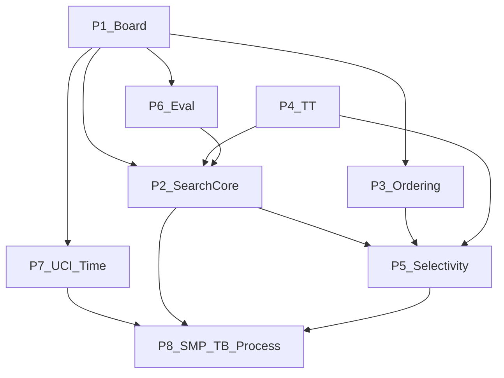

# OpenChess — Engine Pillars & Agent Tasks

> **Audience:** agents implementing OpenChess in parallel.
> **Paradigm:** Stockfish-family (bitboards + PVS + selective search + NNUE + Lazy SMP + SPRT).
> **Research sources:** [chesswiki.md](./chesswiki.md) · [reckless.md](./reckless.md) · [stockfish.md](./stockfish.md)
> **Out of scope here:** speculative ideas in [uniqueideas.md](./uniqueideas.md) — separate track.
>
> **Implementation language: Rust.** Module layout and ownership: [ARCHITECTURE.md](../ARCHITECTURE.md). Do not treat Stockfish/Reckless magic constants as gospel — copy structure, tune with SPRT.

---

## One-sentence model

**A modern top engine = bitboard board + Lazy SMP alpha-beta (PVS) + aggressive selective search + incremental NNUE eval + shared TT + history heuristics + SPRT testing.**

Search is the coordinator. Board and eval are services. UCI is machine I/O; TUI (`P7b`) is human I/O.

---

## How to use this file (agent rules)

1. **Own one pillar or one task ID at a time.** Do not edit another pillar’s core APIs without updating that pillar’s **Contract** section and notifying the owning agent.
2. **Respect deps.** A task is blocked until every listed dep is marked done (`[x]`).
3. **Acceptance over vibes.** Ship only when the task’s acceptance criteria pass (perft, UCI smoke, fixed-node bench, later SPRT).
4. **One selective-search feature at a time (P5).** Measure before stacking the next.
5. **Copy structure, not constants.** Margins/reductions from Stockfish/Reckless are SPRT-tuned for *their* nets — re-tune.
6. **Mark progress in this file.** Flip `- [ ]` → `- [x]` and note the PR/commit if useful.
7. **Link research.** Each task cites the justifying section; read it before implementing.

### Task entry format

| Field | Meaning |
|---|---|
| **ID** | Stable handle, e.g. `P1-03` |
| **Deps** | Other task IDs that must be done first |
| **Parallel-ok** | Pillars/tasks safe to run concurrently |
| **Deliverable** | APIs / modules expected |
| **Acceptance** | Concrete gate |
| **Research** | Pointer into research docs |

---

## Dependency graph

| Pillar | Owns | Does not own |
|---|---|---|
| **P1 Board** | Types, bitboards/mailbox, attacks/magics, make/unmake, legal movegen, Zobrist, pins/checkers, SEE, perft | Search logic, eval scores |
| **P2 Search core** | Iterative deepening, negamax αβ, PVS node types, aspiration, qsearch, search stack, PV | Pruning recipes (P5), move scoring tables (P3) |
| **P3 Ordering & history** | Staged movepick, TT-move first, MVV-LVA/SEE stages, quiet/noisy/continuation/pawn histories | When to prune (P5) |
| **P4 Transposition table** | Clustered TT, bounds, age/replacement, prefetch API, hashfull | Search control flow |
| **P5 Selectivity** | NMP, RFP, razoring, LMR, LMP, futility, ProbCut, IIR, singular/multi-cut, improving | Base αβ/qsearch (P2) |
| **P6 Evaluation** | HCE bootstrap → NNUE FT/accumulator/forward → post-eval corrections | Move choice |
| **P7 UCI & time** | UCI loop/options, soft/hard stop, time formulas, bench/eval debug cmds | Search internals |
| **P8 Scale & science** | Lazy SMP, optional Syzygy, OpenBench/SPRT, PGO/SIMD polish | Feature invention without measurement |

---

## Phased rollout

| Phase | Goal | Unlocks when |
|---|---|---|
| **A — Skeleton** | Play legal chess under UCI | `P1-10`, `P6-01`, `P2-01`, `P7-01` done |
| **B — Scalable search** | Near-minimal tree under the clock | Phase A + `P4-02`, `P3-02`, `P2-03`–`P2-05`, early P5 |
| **C — Eval ceiling** | Leaf quality that rewards depth | Phase B + `P6-05`–`P6-07` |
| **D — Scale & measure** | Elo that is real | Phase C + `P8-01`, `P8-03` |

**Safe to parallelize in Phase A:** P1 (full), P4 API stub (`P4-01`), P6 material (`P6-01`), P7 UCI stub (`P7-01` after `P1-09`).

---

## Parallelism matrix

| Now working on | Can also run |
|---|---|
| P1 Board | P4-01 stub, P6-01 (types only until board exists), docs |
| P1 perft green | P3 API design, P4 full, P6-01/02, P7-01 |
| P2 Search core | P3, P4 (wire as ready), P6 HCE growth, P7 TM |
| P5 Selectivity | P6 NNUE (if search stable), P7 polish — **not** another P5 feature |
| P6 NNUE | P5 (one feature), P8 OpenBench harness prep |
| P8 SMP | Only after single-thread strength is trustworthy |

---

## P1 — Board

**Contract:** Expose a reversible position: FEN in/out, make/unmake, legal move list, Zobrist key, checkers/pins, SEE. No search or eval policy lives here. Eval may register an observer for incremental updates (NNUE) without owning move application.

**Research:** [chesswiki §1](./chesswiki.md#1-board-representation-the-foundation) · [reckless §5](./reckless.md#5-board-representation-stockfish-family-standard) · [stockfish §8](./stockfish.md#8-board-representation-position)

### Tasks

- [x] **P1-01** — Core types vocabulary  
  - **Deps:** none  
  - **Parallel-ok:** P4-01, P6-01 (score type only), P7 docs  
  - **Deliverable:** `Color`, `Piece`, `PieceType`, `Square`, `Move`, `Bitboard`, `Score`/`Value`, castling rights  
  - **Acceptance:** Types compile; moves encode from/to/promo; no illegal bit widths  
  - **Research:** reckless §3 `types/` · stockfish `types.h`

- [x] **P1-02** — Dual representation: bitboards + mailbox  
  - **Deps:** P1-01  
  - **Parallel-ok:** P4-01, P7-01 (blocked on FEN until P1-09)  
  - **Deliverable:** Position holding piece bitboards, color sets, occupancy, `[Piece; 64]` mailbox  
  - **Acceptance:** Set/clear piece updates both views consistently  
  - **Research:** chesswiki §1 hybrid · reckless §5

- [x] **P1-03** — Attack tables / magic bitboards  
  - **Deps:** P1-01  
  - **Parallel-ok:** P1-02  
  - **Deliverable:** Init-once slider attacks (magics or PEXT); leaper attacks; attack-to helpers  
  - **Acceptance:** Known attack sets for corner/center bishops/rooks/knights match reference  
  - **Research:** chesswiki Bitboards/Magics · stockfish `attacks.*`

- [x] **P1-04** — Make / unmake + state stack  
  - **Deps:** P1-02, P1-03  
  - **Parallel-ok:** P4-01  
  - **Deliverable:** Reversible do/undo storing captured piece, rights, EP, halfmove, hash delta  
  - **Acceptance:** Random walk of make/unmake restores identical board and key  
  - **Research:** chesswiki Make/unmake · reckless `makemove.rs`

- [x] **P1-05** — Move generation (pseudo-legal or legal)  
  - **Deps:** P1-04  
  - **Parallel-ok:** P6-01  
  - **Deliverable:** Generate captures, quiets, evasions; filter illegal or generate legal-only  
  - **Acceptance:** Startpos has 20 legal moves; after `e2e4` has 20  
  - **Research:** chesswiki §1 · stockfish `movegen.*`

- [x] **P1-06** — Incremental Zobrist  
  - **Deps:** P1-04  
  - **Parallel-ok:** P1-05, P4-01  
  - **Deliverable:** Keys for piece×square, side, castling, EP; XOR on make/unmake  
  - **Acceptance:** Full rehash equals incremental key after 1000 random plies  
  - **Research:** chesswiki §4 · stockfish position Zobrist

- [x] **P1-07** — Checkers, pins, threats  
  - **Deps:** P1-05, P1-03  
  - **Parallel-ok:** P1-06, P1-08  
  - **Deliverable:** Incremental or refreshed checkers/pinners/pinned; optional threat map  
  - **Acceptance:** Known check/pin positions classified correctly; king evasion set matches hand cases  
  - **Research:** reckless §5 critical board features · stockfish §8

- [x] **P1-08** — Static Exchange Evaluation (SEE)  
  - **Deps:** P1-03, P1-05  
  - **Parallel-ok:** P1-06, P1-07  
  - **Deliverable:** SEE(move) → material sequence score; used later by P3/P5  
  - **Acceptance:** Textbook winning/losing captures return correct sign on a fixture set  
  - **Research:** chesswiki Move Ordering / SEE · reckless `see.rs`  
  - **Note:** First-move promotion bonus modeled in swap; recapture promotions still unmodeled.

- [x] **P1-09** — FEN + UCI move parsing  
  - **Deps:** P1-04, P1-05  
  - **Parallel-ok:** P1-07, P1-08  
  - **Deliverable:** Parse/set FEN; parse UCI move strings against current position  
  - **Acceptance:** Round-trip startpos FEN; reject illegal UCI moves  
  - **Research:** stockfish `position` FEN · reckless `parser.rs`

- [x] **P1-10** — Perft suite (hard gate)  
  - **Deps:** P1-05, P1-06, P1-07, P1-09  
  - **Parallel-ok:** P3 design, P4 full, P6-01, P7-01  
  - **Deliverable:** `perft(depth)` + standard suite (startpos, Kiwipete, etc.)  
  - **Acceptance:**  
    - startpos `perft(6) = 119060324`  
    - Kiwipete (`r3k2r/p1ppqpb1/bn2pnp1/3PN3/1p2P3/2N2Q1p/PPPBBPPP/R3K2R w KQkq -`) `perft(5) = 193690690`  
    - No illegal moves in sampled dumps  
  - **Research:** chesswiki §7 / Getting Started · stockfish `perft.h`

---

## P2 — Search core

**Contract:** Own the search loop and PV. Call board make/unmake, ask P3 for the next move, probe/store P4, score leaves via P6. Do not embed pruning margins here beyond what P5 will later inject behind clear hooks.

**Research:** [chesswiki §2](./chesswiki.md#2-search--the-engines-brain) · [reckless §6](./reckless.md#6-search-architecture-the-brain) · [stockfish §9](./stockfish.md#9-search-architecture-searchcpp)

### Tasks

- [x] **P2-01** — Negamax alpha-beta + material leaf  
  - **Deps:** P1-10, P6-01  
  - **Parallel-ok:** P3-01, P4-02, P7-02  
  - **Deliverable:** Fail-soft αβ; side-to-move relative scores; root best move  
  - **Acceptance:** From startpos `go depth 4` returns a legal move; no crashes on checks  
  - **Research:** chesswiki Baseline stack · stockfish search progression

- [x] **P2-02** — Iterative deepening  
  - **Deps:** P2-01  
  - **Parallel-ok:** P3-02, P4-02, P7-02  
  - **Deliverable:** Depth 1..N loop; always keep last completed best move; stop between iterations  
  - **Acceptance:** Abort mid-ID still emits prior bestmove; deeper depth can change move  
  - **Research:** reckless §6.1 · chesswiki Iterative deepening

- [x] **P2-03** — Quiescence search  
  - **Deps:** P2-01, P1-08 (SEE helpful), P6-01  
  - **Parallel-ok:** P2-02, P3-02  
  - **Deliverable:** At depth ≤ 0 search captures (optional checks); stand-pat; delta/SEE prune hooks  
  - **Acceptance:** Hanging-queen positions no longer evaluate as quiet wins at shallow depth  
  - **Research:** chesswiki Quiescence · reckless §6.4 · stockfish §9.4  
  - **Note:** QS probes/stores TT at depth 0; in-check uses `MovePicker::evasion`.

- [x] **P2-04** — Search stack + PV table  
  - **Deps:** P2-01  
  - **Parallel-ok:** P2-02, P2-03  
  - **Deliverable:** Per-ply stack (static eval slot, move count, killers hook, PV triangle/array)  
  - **Acceptance:** UCI `info` can print a legal PV of length ≥ depth on quiet positions  
  - **Research:** stockfish `Stack` / `RootMove` · reckless `stack.rs`

- [x] **P2-05** — Aspiration windows  
  - **Deps:** P2-02, P2-04  
  - **Parallel-ok:** P2-06, P3-03  
  - **Deliverable:** Narrow root window around previous score; widen + re-search on fail  
  - **Acceptance:** Stable positions often complete without full-window re-search; fail-high/low still correct  
  - **Research:** reckless §6.1 · stockfish §9.1

- [x] **P2-06** — PVS with Root / PV / NonPV node types  
  - **Deps:** P2-02, P2-03, P3-02, P4-02  
  - **Parallel-ok:** P2-05, P5-01 (after this lands)  
  - **Deliverable:** First move full window; siblings null-window + re-search; node-type specialization  
  - **Acceptance:** Bench node counts drop vs plain αβ at fixed depth without illegal moves; PV preserved  
  - **Research:** reckless §6.2 · stockfish §9.2 · chesswiki PVS

---

## P3 — Ordering & history

**Contract:** Given a position and stage context, yield moves best-first. Own history tables and scoring. Do not decide LMR/LMP cutoffs (P5 reads history scores).

**Research:** [chesswiki Move ordering](./chesswiki.md#2-search--the-engines-brain) · [reckless §6.5](./reckless.md#65-move-ordering-more-important-than-people-think) · [stockfish §9.5](./stockfish.md#95-move-ordering-movepickcpp)

### Tasks

- [x] **P3-01** — Move list + score/pick-best API  
  - **Deps:** P1-05  
  - **Parallel-ok:** P1-10, P4-*, P2-01  
  - **Deliverable:** Scored move list; partial sort / pick-best without full sort requirement  
  - **Acceptance:** Unit test: highest score returned first repeatedly  
  - **Research:** chesswiki “never generate unsorted” · reckless movepick

- [x] **P3-02** — Staged MovePicker  
  - **Deps:** P3-01, P1-08, P4-02 (TT move; stub hash move OK early)  
  - **Parallel-ok:** P2-03, P2-06  
  - **Deliverable:** Stages: TT → good noisy (SEE≥0) → quiets → bad noisy; evasion/qsearch variants  
  - **Acceptance:** In cut-node fixtures, TT/good-capture tried before losing captures  
  - **Research:** reckless §6.5 stages · stockfish `MovePicker` stages  
  - **Note:** `Main` / `Qsearch` / `Evasion` picker kinds landed.

- [ ] **P3-03** — Killers + quiet history (butterfly)  
  - **Deps:** P3-02, P2-04  
  - **Parallel-ok:** P2-06, P5-01  
  - **Deliverable:** Killer slots per ply; history updates on quiet cutoffs; history-ordered quiets  
  - **Acceptance:** After a quiet cutoff, same quiet ranks higher on revisit  
  - **Research:** chesswiki History heuristic · stockfish `history.h`

- [ ] **P3-04** — Capture / continuation / pawn history  
  - **Deps:** P3-03  
  - **Parallel-ok:** P5-02, P5-03  
  - **Deliverable:** Noisy history; continuation (1/2/… ply); optional pawn-structure keyed history  
  - **Acceptance:** Histories update without overflowing; LMR/LMP can read scores (API stable)  
  - **Research:** reckless `history.rs` · stockfish continuation/pawn history

---

## P4 — Transposition table

**Contract:** Shared cache of bound/score/move/depth keyed by Zobrist. Search owns when to probe/store. Thread-safe enough for Lazy SMP later (racy OK if documented).

**Research:** [chesswiki §4](./chesswiki.md#4-memory--hashing) · [reckless §6.6](./reckless.md#66-transposition-table) · [stockfish §11](./stockfish.md#11-transposition-table-ttcpp--tth)

### Tasks

- [x] **P4-01** — TT API stub + key contract  
  - **Deps:** P1-01 (key type), P1-06 preferred  
  - **Parallel-ok:** all of P1 after types  
  - **Deliverable:** `probe(key) → Option<Entry>`, `store(...)`, `clear`, `new_search` age bump  
  - **Acceptance:** Store then probe same key returns move/depth/bound; wrong key misses  
  - **Research:** chesswiki TT contents

- [x] **P4-02** — Clustered TT + replacement  
  - **Deps:** P4-01, P1-06  
  - **Parallel-ok:** P2-*, P3-02, P7 Hash option  
  - **Deliverable:** Multi-entry clusters; exact/lower/upper; age; depth-preferred replacement; hashfull  
  - **Acceptance:** Fill table; `hashfull` rises; shallower/stale entries replaced under pressure  
  - **Research:** reckless clustered TT · stockfish `tt.cpp`

- [ ] **P4-03** — Mate score ply adjust + prefetch hook  
  - **Deps:** P4-02, P2-01  
  - **Parallel-ok:** P2-06, P5-*  
  - **Deliverable:** Mate/TB scores stored relative to root/ply; optional prefetch on make  
  - **Acceptance:** Mate in 3 from root still reports mate in 3 after TT hit at child ply  
  - **Research:** reckless §6.6 · stockfish TT value adjust

---

## P5 — Selectivity

**Contract:** Reduce effective branching factor. Each task adds **one** technique behind flags/hooks in P2. Disable in check / zugzwang where required. Tune later with SPRT — do not cargo-cult margins.

**Research:** [chesswiki Selectivity](./chesswiki.md#2-search--the-engines-brain) · [reckless §6.3](./reckless.md#63-selective-search-catalog-must-know) · [stockfish §9.3](./stockfish.md#93-selective-search-catalog)

### Tasks

- [ ] **P5-00** — Improving flag  
  - **Deps:** P2-04, P6-01  
  - **Parallel-ok:** P5-01  
  - **Deliverable:** `improving` when static eval better than ~2 plies ago; exposed to prune/reduce margins  
  - **Acceptance:** Flag true/false on constructed eval sequences  
  - **Research:** reckless/stockfish “improving”

- [ ] **P5-01** — Null move pruning (NMP)  
  - **Deps:** P2-06, P3-02, P4-02, P5-00  
  - **Parallel-ok:** P6-03 (not another prune)  
  - **Deliverable:** Null move + reduced search; disable in check / obvious zugzwang; verification as desired  
  - **Acceptance:** Fixed-depth bench nodes drop vs no-NMP; no illegal null in check; tactical suite smoke OK  
  - **Research:** chesswiki NMP · reckless catalog

- [ ] **P5-02** — Late move reductions (LMR)  
  - **Deps:** P5-01, P3-03  
  - **Parallel-ok:** P6-03  
  - **Deliverable:** Reduce late quiet moves; re-search on fail-high; log-depth×log-move style table  
  - **Acceptance:** Node count ↓ at fixed depth; PV move not reduced; re-search path works  
  - **Research:** chesswiki LMR · stockfish move loop

- [ ] **P5-03** — Reverse futility (RFP) + razoring  
  - **Deps:** P5-01  
  - **Parallel-ok:** P5-02 (prefer sequential if same agent)  
  - **Deliverable:** RFP fail-high on high eval at low depth; razoring drop to qsearch when very low  
  - **Acceptance:** NonPV-only (or documented); no RFP when in check  
  - **Research:** reckless §6.3 · stockfish steps ~7–9

- [ ] **P5-04** — LMP + futility + history/SEE move-loop pruning  
  - **Deps:** P5-02, P3-03, P1-08  
  - **Parallel-ok:** P6-04  
  - **Deliverable:** Skip late quiets (LMP); futility near leaves; history prune; SEE prune losing captures  
  - **Acceptance:** Each sub-flag can toggle; smoke tests pass with all on  
  - **Research:** chesswiki LMP/futility/SEE · reckless move loop

- [ ] **P5-05** — ProbCut + IIR  
  - **Deps:** P5-04, P3-02  
  - **Parallel-ok:** P6-05  
  - **Deliverable:** ProbCut shallow capture proof; IIR when no TT move  
  - **Acceptance:** Triggers on fixtures; no search explosion; TT miss path reduces as designed  
  - **Research:** stockfish ProbCut / IIR · reckless catalog

- [ ] **P5-06** — Singular extensions + multi-cut + negative extensions  
  - **Deps:** P5-05, P4-02  
  - **Parallel-ok:** P6-06, P8-03 harness  
  - **Deliverable:** TT move singular → extend; multi-cut prune; negative reduce when non-singular  
  - **Acceptance:** Extension counts visible in debug; no illegal depths; fixed-node smoke stable  
  - **Research:** reckless singular/multi-cut · stockfish step ~15

---

## P6 — Evaluation

**Contract:** Return a side-to-move-relative score. NNUE is an **eval, not a policy** — it does not suggest moves. Board notifies observers on make/unmake for incremental FT updates.

**Research:** [chesswiki §3](./chesswiki.md#3-evaluation) · [reckless §7](./reckless.md#7-nnue-evaluation-why-stockfish-works-so-well) · [stockfish §10](./stockfish.md#10-nnue-evaluation-current-master)

### Tasks

- [x] **P6-01** — Material evaluation  
  - **Deps:** P1-02  
  - **Parallel-ok:** P1-05..P1-10, P7-01  
  - **Deliverable:** Sum piece values; STM-relative  
  - **Acceptance:** Startpos = 0; remove white queen → large negative for White to move  
  - **Research:** chesswiki HCE material

- [ ] **P6-02** — Piece-square tables (PSTs)  
  - **Deps:** P6-01  
  - **Parallel-ok:** P2-01  
  - **Deliverable:** Midgame PSTs added to material  
  - **Acceptance:** Knight on rim < knight on center all else equal  
  - **Research:** chesswiki PSTs

- [ ] **P6-03** — Tapered HCE extras (optional growth)  
  - **Deps:** P6-02  
  - **Parallel-ok:** P5-*, P2-*  
  - **Deliverable:** Phase interpolate MG/EG; basic pawn structure / king safety as needed  
  - **Acceptance:** Phase 0 and phase 24 endpoints differ sensibly; no search crashes  
  - **Research:** chesswiki HCE terms · Phase C in chesswiki §8

- [ ] **P6-04** — Board observer hooks for incremental eval  
  - **Deps:** P1-04, P6-01  
  - **Parallel-ok:** P6-05 design  
  - **Deliverable:** Observer callbacks on piece add/remove/move for accumulator dirty tracking  
  - **Acceptance:** Make/unmake notifies matching feature deltas in a mock observer  
  - **Research:** reckless `BoardObserver` · stockfish dirty features

- [ ] **P6-05** — NNUE feature transformer + accumulator  
  - **Deps:** P6-04, P1-10  
  - **Parallel-ok:** P5-05, P8-03  
  - **Deliverable:** Sparse king-relative (or chosen) features; dual accumulators; incremental update + refresh  
  - **Acceptance:** Incremental accumulator matches full refresh after random games  
  - **Research:** reckless §7.1–7.3 · stockfish §10.1–10.4 · chesswiki NNUE

- [ ] **P6-06** — NNUE forward (quantized) + embed/load net  
  - **Deps:** P6-05  
  - **Parallel-ok:** P5-06, P7 EvalFile option  
  - **Deliverable:** FT → small MLP → scalar; load embedded or file weights; SIMD optional later  
  - **Acceptance:** `eval` on startpos finite/stable; same position → same score; NPS still usable vs HCE  
  - **Research:** reckless §7.2 · stockfish Network::evaluate

- [ ] **P6-07** — Post-NNUE corrections  
  - **Deps:** P6-06, P3-04 (correction history tables may live with history)  
  - **Parallel-ok:** P8-01  
  - **Deliverable:** Material/optimism scaling, 50-move dampening, correction history residual; clamp vs mate range  
  - **Acceptance:** Raw net ≠ final eval when corrections active; mate scores not clobbered  
  - **Research:** reckless §7.4 · stockfish `evaluate.cpp`

---

## P7 — UCI & time management

**Contract:** stdin/stdout protocol only. Translate `position`/`go` into engine calls; enforce soft/hard stop. Do not implement search inside the UCI file.

**Research:** [chesswiki §6](./chesswiki.md#6-protocols--product-surface) · [reckless §9](./reckless.md#9-time-management--uci) · [stockfish §13](./stockfish.md#13-time-management-timemancpp) · [stockfish §15](./stockfish.md#15-uci-surface-high-signal-options)

### Tasks

- [x] **P7-01** — Minimal UCI loop  
  - **Deps:** P1-09  
  - **Parallel-ok:** P1-10, P2-01, P6-01  
  - **Deliverable:** `uci`, `isready`, `ucinewgame`, `position`, `go`, `stop`, `quit` → `bestmove`  
  - **Acceptance:** Speaks UCI with a GUI or `cutechess`; `go depth 1` returns legal bestmove  
  - **Research:** chesswiki UCI · stockfish uci loop

- [ ] **P7-02** — Time management soft/hard  
  - **Deps:** P7-01, P2-02  
  - **Parallel-ok:** P2-05, P4-02  
  - **Deliverable:** Parse `wtime/btime/winc/binc/movestogo`; soft ≈ `remaining/20 + inc/2`; hard abort; Move Overhead  
  - **Acceptance:** `go wtime 5000 winc 50` stops before hard limit; never exceeds hard by more than overhead slack  
  - **Research:** chesswiki Time management · stockfish timeman · reckless soft/hard

- [ ] **P7-03** — UCI options + debug helpers  
  - **Deps:** P7-01, P4-02  
  - **Parallel-ok:** P6-06, P8-01  
  - **Deliverable:** `Hash`, `Threads` (stub until P8), `Move Overhead`; `bench` / `perft` / `eval` / `d`  
  - **Acceptance:** `setoption name Hash value 64` resizes TT; `bench` prints nodes  
  - **Research:** reckless UCI options table · stockfish §15

- [ ] **P7-04** — Adaptive TM (stability)  
  - **Deps:** P7-02, P2-05  
  - **Parallel-ok:** P5-*, P8-*  
  - **Deliverable:** Spend more on best-move changes / eval swings; less when stable  
  - **Acceptance:** Volatile roots use more of optimum than dead-drawn roots in logging  
  - **Research:** stockfish fallingEval / bestMoveChanges · reckless TM

---

## P7b — Terminal UI (ratatui)

**Contract:** Human-facing TUI only. Call the same session API UCI will use (`position` / apply-undo / `go` / `stop` / `info` / `bestmove`). Do not implement search or board legality inside `tui/`. Do not replace P7 UCI — cutechess still requires the protocol loop.

**Ownership:** `src/tui/` only. Do not edit P1 `types/` / `board/` / `lookup` APIs without coordinating with the P1 agent.

**Stack:** `ratatui` + `crossterm`. Binary: `openchess tui`.

### Tasks

- [x] **TUI-01** — ratatui scaffold + board render  
  - **Deps:** P1-02 (need `Board::startpos` / `piece_on`)  
  - **Parallel-ok:** P1-03..P1-10, P7-01, P2-*  
  - **Deliverable:** `src/tui/` event loop; Unicode board from `Board`; `openchess tui` enters UI; `q` quits  
  - **Acceptance:** `cargo run -- tui` shows startpos; quit restores terminal  
  - **Research:** ARCHITECTURE §3 `tui/` · ratatui docs

- [x] **TUI-02** — Move input + apply/undo  
  - **Deps:** TUI-01; prefer P1-04 + P1-05 + P1-09 for real legality (sandbox adapter OK until then)  
  - **Parallel-ok:** P1-*, P7-01, P2-*  
  - **Deliverable:** UCI move typing (`e2e4`, promos); optional simple SAN; undo; flip board; new game; status line for errors  
  - **Acceptance:** Can play a short human sandbox game from startpos; illegal/unknown input rejected with message; undo restores prior position  
  - **Research:** ARCHITECTURE dual fronts · chesswiki UCI move strings

- [x] **TUI-03** — Engine think panel  
  - **Deps:** TUI-02, P2-01 (real search); stub `go`/`info`/`bestmove` OK until search lands  
  - **Parallel-ok:** P7-01, P2-02..  
  - **Deliverable:** Engine panel shows depth/score/PV/nodes/time while thinking; on engine turn applies `bestmove`; human vs engine color choice  
  - **Acceptance:** With search available, `go depth N` (or movetime) updates panel then plays a legal move; Stop cancels thinking  
  - **Research:** ARCHITECTURE §7 · stockfish UCI info lines
  - **Note:** Wired to real `search::go` via background thread in `tui/session.rs`.
---

## P8 — Scale & science

**Contract:** Own parallelism, optional tablebases, and the measurement process. **No functional strength claim without a test plan.** Perft/bench gates are mandatory from day one; SPRT becomes mandatory before rating-list chasing.

**Research:** [chesswiki §7](./chesswiki.md#7-scientific-development-non-negotiable-for-strength) · [reckless §6.7](./reckless.md#67-lazy-smp) · [stockfish §12](./stockfish.md#12-lazy-smp-threadcpp-numah) · [stockfish §17](./stockfish.md#17-fishtest--why-strength-keeps-rising)

### Tasks

- [ ] **P8-00** — Correctness harness (day one)  
  - **Deps:** none (grows with P1/P2)  
  - **Parallel-ok:** everyone  
  - **Deliverable:** Scripts/CI targets for perft + bench signature + UCI smoke  
  - **Acceptance:** One command runs perft gates; fails CI on mismatch  
  - **Research:** chesswiki Engine Testing · stockfish tests/

- [ ] **P8-01** — Lazy SMP  
  - **Deps:** P2-06, P4-02, P3-03, P7-03  
  - **Parallel-ok:** P6-07, P8-03  
  - **Deliverable:** N workers search same root; shared TT; per-thread histories/accumulators; best-thread vote  
  - **Acceptance:** `Threads 4` increases NPS; no data races under TSan (or documented racy TT only); still legal bestmove  
  - **Research:** reckless Lazy SMP · stockfish ThreadPool

- [ ] **P8-02** — Syzygy (optional)  
  - **Deps:** P2-06, P7-03  
  - **Parallel-ok:** P8-01, P6-06  
  - **Deliverable:** WDL probe in search; DTZ at root; `SyzygyPath`; skip heavy probes in qsearch  
  - **Acceptance:** Known 5-man win returns TB score/mate bound; root ranking prefers DTZ-progress  
  - **Research:** chesswiki Syzygy · reckless `tb.rs` · stockfish syzygy/

- [ ] **P8-03** — OpenBench / SPRT workflow  
  - **Deps:** P7-01, P8-00, Phase B search minimum  
  - **Parallel-ok:** P5-06, P6-06, P8-01  
  - **Deliverable:** Match book + cutechess/OpenBench config; SPRT accept/reject doc for patches  
  - **Acceptance:** Can run self-play SPRT locally; CONTRIBUTING-style rule: functional PRs link a test  
  - **Research:** chesswiki §7 · stockfish Fishtest · reckless OpenBench

- [ ] **P8-04** — Perf polish (PGO / SIMD / NUMA)  
  - **Deps:** P6-06, P8-01  
  - **Parallel-ok:** P8-02  
  - **Deliverable:** Profile-guided build; SIMD paths for NNUE; optional NUMA weight replication  
  - **Acceptance:** Measurable NPS gain on target CPU; no correctness drift vs scalar  
  - **Research:** reckless release profile / simd · stockfish Makefile PGO / numa

---

## Critical path (Elo order)

Matches the shared agent roadmap in reckless §11 / stockfish §21 / chesswiki §8:

1. Board + legal movegen + make/unmake → **P1**  
2. Negamax αβ + iterative deepening → **P2-01, P2-02**  
3. Quiescence + MVV-LVA / SEE → **P2-03, P1-08, P3-02**  
4. TT + TT-move ordering → **P4, P3-02**  
5. Null move + LMR + basic history → **P5-01, P5-02, P3-03**  
6. Aspiration + PVS → **P2-05, P2-06**  
7. RFP, LMP, futility, ProbCut, singular → **P5-03..P5-06**  
8. NNUE → **P6-04..P6-07**  
9. Lazy SMP → **P8-01**  
10. Corrections / threat history / NUMA / PGO → **P6-07, P3-04, P8-04**  
11. OpenBench SPRT → **P8-03**

Do **not** start with MCTS + deep GPU nets unless deliberately leaving this task board.

---

## Failure modes (if a pillar is weak)

| Missing piece | Symptom |
|---|---|
| Bad move ordering (P3) | Pruning unsafe or useless |
| No quiescence (P2-03) | Horizon / tactical blindness |
| Slow eval (P6) | Cannot reach depth |
| No TT (P4) | Massive re-search waste |
| No SPRT (P8-03) | Elo noise; false improvements |
| Deep GPU net inside AB | Too slow; AB needs NPS |

---

## Glossary

| Term | Meaning |
|---|---|
| **PV** | Principal variation — current best line |
| **Cut / All node** | Expected fail-high / fail-low |
| **LMR** | Late move reductions |
| **NMP** | Null move pruning |
| **SEE** | Static exchange evaluation |
| **TT** | Transposition table |
| **NNUE** | Efficiently updatable neural network eval |
| **FT** | Feature transformer (first NNUE layer) |
| **Accumulator** | Cached FT state updated incrementally |
| **Lazy SMP** | Parallel independent searches + shared TT |
| **SPRT** | Sequential probability ratio test for patches |
| **GHI** | Graph history interaction (path-dependent draws vs hash) |

---

## Research index

| Doc | Use for |
|---|---|
| [chesswiki.md](./chesswiki.md) | Concepts, build order, testing discipline |
| [reckless.md](./reckless.md) | Readable Rust embodiment of the full stack |
| [stockfish.md](./stockfish.md) | Canonical C++ layout, current NNUE, Fishtest |
| [uniqueideas.md](./uniqueideas.md) | Non-goals for this board — exploration track |

---

*Task board synthesized 2026-07-10 from chesswiki / reckless / stockfish research.*
