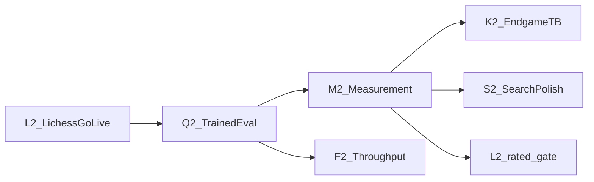

# OpenChess — Phase 2 Task Board

> **Audience:** agents raising Elo and taking the Lichess bot to production-safe play.
> **Paradigm:** Stockfish-family (bitboards + PVS + selective search + NNUE + Lazy SMP + SPRT) — unchanged from Phase 1.
> **Phase 1 archive:** [tasks-phase1.md](./tasks-phase1.md) (complete SF-family skeleton + arena + Lichess CLI).
> **Research sources:** [chesswiki.md](./chesswiki.md) (Phase D) · [LICHESS.md](./LICHESS.md) · [openings.md](./openings.md) · [reckless.md](./reckless.md) · [stockfish.md](./stockfish.md)
> **Out of scope:** speculative ideas in [uniqueideas.md](./uniqueideas.md) — separate track.
>
> **Implementation language: Rust.** Module layout: [ARCHITECTURE.md](../ARCHITECTURE.md). Copy structure from research, retune with SPRT — especially after the trained net lands.

---

## One-sentence model

**Phase 2 = measure-and-raise Elo (trained NNUE + SPRT) while making the existing Lichess daemon production-safe for casual, then rated, play.**

---

## How to use this file (agent rules)

1. **Own one pillar or one task ID at a time.** Do not edit another pillar’s core APIs without updating that pillar’s **Contract** section and notifying the owning agent.
2. **Respect deps.** A task is blocked until every listed dep is marked done (`[x]`).
3. **Acceptance over vibes.** Ship only when the task’s acceptance criteria pass (SPRT, live Lichess smoke, fixed-node bench, unit fixtures).
4. **One strength change at a time.** After Q2 lands a trained net, retune/search/TB changes go through SPRT individually.
5. **Mark progress in this file.** Flip `- [ ]` → `- [x]` and note the PR/commit if useful.
6. **Link research.** Each task cites the justifying section; read it before implementing.
7. **Do not re-implement Phase 1.** Book, arena, Lichess CLI skeleton, and search selectivity already shipped — see [tasks-phase1.md](./tasks-phase1.md).

### Task entry format

| Field | Meaning |
|---|---|
| **ID** | Stable handle, e.g. `L2-02` |
| **Deps** | Other task IDs that must be done first |
| **Parallel-ok** | Pillars/tasks safe to run concurrently |
| **Deliverable** | APIs / docs / modules expected |
| **Acceptance** | Concrete gate |
| **Research** | Pointer into research docs |

---

## Dependency graph

| Pillar | Owns | Does not own |
|---|---|---|
| **L2 Lichess go-live** | Live smoke, ops config, accept policy, rated gate, concurrent games | Search/eval training, UCI protocol |
| **Q2 Trained eval** | Data pipeline, Bullet/self-play training, shipping successor net via `EvalFile` / embed | SPRT books, Syzygy, Lichess HTTP |
| **M2 Measurement** | Larger SPRT openings, strength-PR rules, post-net margin retune process | Net architecture, Lichess daemon |
| **K2 Endgame** | Syzygy WDL/DTZ + `SyzygyPath` (Phase 1 **P8-02**) | Eval training, opening book |
| **S2 Search polish** | NMP verification, SEE promo completeness, optional ponder | Leaf net weights, Lichess I/O |
| **F2 Throughput** | PGO build, SIMD NNUE forward (Phase 1 **P8-04**) | Functional strength claims without SPRT |

---

## Critical path

1. **Lichess live smoke** (L2-01..L2-03) — can start immediately; needs a bot token.
2. **Trained NNUE** (Q2-01..Q2-03) — main Elo lever; replace material-distilled bootstrap.
3. **SPRT at scale** (M2-01..M2-02) — real openings; OwnBook false.
4. **Post-net retune / Syzygy** (M2-03, K2-01, S2-*) — one change at a time.
5. **Throughput** (F2-01..F2-02) — after the shipped net is stable.
6. **Rated Lichess** (L2-06) — only after the documented strength bar.
7. **Concurrent Lichess games** (L2-07) — after single-game live stability.

---

## Parallelism matrix

| Now working on | Can also run |
|---|---|
| L2-01..L2-05 (docs/ops/smoke) | Q2-01 data pipeline design |
| Q2-01 / Q2-02 (train) | L2-01..L2-04; M2-01 book prep |
| Q2-03 ship net | M2-01; F2 design |
| M2-03 retune | K2-01 Syzygy; **not** another retune at once |
| F2-01 / F2-02 | L2-05 policy docs; **not** Q2 net architecture churn |
| L2-07 concurrent games | Only after L2-02 and L2-03 |

---

## Non-goals

- Speculative search/eval from [uniqueideas.md](./uniqueideas.md)
- Chess.com as a strength path
- TUI Lichess mirror panel
- Replacing the Stockfish-family stack (MCTS-only, GPU searchless, etc.)
- Rebuilding Phase 1 book / arena / Lichess CLI from scratch

---

## L2 — Lichess go-live

**Contract:** Make `openchess lichess` production-safe for casual play, then rated. Own smoke checklists, accept-policy defaults, config files, and (later) multi-game concurrency. Do not change search internals here. Phase 1 CLI/game loop lives in `src/lichess/` ([tasks-phase1.md](./tasks-phase1.md) P9).

**Research:** [LICHESS.md](./LICHESS.md) · [LICHESS §11](./LICHESS.md#110-cli-only--no-tui) · [LICHESS §14](./LICHESS.md#14-open-questions)

### Tasks

- [x] **L2-01** — Operator docs: token setup + smoke checklist  
  - **Deps:** none  
  - **Parallel-ok:** Q2-01, M2-01  
  - **Deliverable:** README / CONTRIBUTING section: create bot account, `LICHESS_TOKEN`, `lichess account`, `lichess run` (dry-run) → `--play`, challenge flow  
  - **Acceptance:** Operator can go dry-run → play from docs alone without reading research docs  
  - **Research:** [LICHESS §4](./LICHESS.md#4-account-setup) · README Lichess section  
  - **Note:** README “Lichess bot” setup + smoke checklist; `.env.example` comments; examples under `examples/lichess.{toml,json}`.

- [ ] **L2-02** — Live casual game smoke  
  - **Deps:** L2-01  
  - **Parallel-ok:** L2-04, Q2-01  
  - **Deliverable:** Manual (or scripted) run completing one casual (`rated=false`) game vs a weak online bot  
  - **Acceptance:** Full game completes; no illegal moves; no time forfeit caused by engine/bot bugs; note game URL in task Note  
  - **Research:** [LICHESS §8](./LICHESS.md#8-challenges--bot-matchmaking) · closes Phase 1 P9-03 / P9-05 live notes  
  - **Note:** Blocked on operator bot token + live run (ops path documented in L2-01).

- [ ] **L2-03** — Live reconnect + PGN verify  
  - **Deps:** L2-02  
  - **Parallel-ok:** L2-04, L2-05  
  - **Deliverable:** Forced event-stream disconnect recovers without double-accept; `pgn::export_game` output matches lichess.org for a played game  
  - **Acceptance:** Reconnect survives manual kill of stream; exported PGN movetext/result match site; Note with evidence  
  - **Research:** [LICHESS §11.4](./LICHESS.md#114-error-handling--reconnects) · closes Phase 1 P9-06 / P9-07 live notes

- [x] **L2-04** — Ops config file + CLI overrides  
  - **Deps:** none (code) / prefer L2-01 for docs  
  - **Parallel-ok:** L2-02, L2-05, Q2-*  
  - **Deliverable:** Load Lichess accept/matchmaking policy from TOML or JSON on disk; CLI flags override file; shape matches `LichessConfig` (speeds, rated, humans, rating band, variants)  
  - **Acceptance:** Config file alone drives accept filter without recompile; unit tests cover load + override precedence  
  - **Research:** [LICHESS §11.3](./LICHESS.md#113-config-surface-minimal) · Phase 1 note that TOML mapping was future  
  - **Note:** `LichessConfig::load_from_path` + `ConfigOverrides`; `--config` / `--speeds` / policy flags on `lichess run`.

- [x] **L2-05** — Default policy: bots-preferred, rated off  
  - **Deps:** L2-04  
  - **Parallel-ok:** L2-02, L2-03  
  - **Deliverable:** Defaults decline rated until L2-06; humans opt-in (`accept_humans` default false or documented bot-preferred); speeds/variants stay standard-safe  
  - **Acceptance:** Default config declines surprise rated human challenges; bot-vs-bot casual still accepted  
  - **Research:** [LICHESS §10](./LICHESS.md#10-restrictions--fair-play) · [LICHESS §14 #5](./LICHESS.md#14-open-questions)  
  - **Note:** Defaults `accept_rated=false`, `accept_humans=false`; ponder off documented on Lichess path.

- [ ] **L2-06** — Rated gate  
  - **Deps:** L2-02, L2-03, M2-02, Q2-03  
  - **Parallel-ok:** K2-01, F2-*  
  - **Deliverable:** Documented strength bar (local SPRT / arena smoke) before enabling `accept_rated`; config default flip + CONTRIBUTING note  
  - **Acceptance:** Checklist in CONTRIBUTING/README; default stays casual until bar met and task marked done with evidence  
  - **Research:** [LICHESS §14 #3](./LICHESS.md#14-open-questions)  
  - **Note:** Blocked on Q2-03 + M2-02 (+ live L2-02/03). Defaults remain casual.

- [ ] **L2-07** — Concurrent games  
  - **Deps:** L2-02, L2-03  
  - **Parallel-ok:** F2-*, K2-01 (after M2)  
  - **Deliverable:** Tokio or thread-per-game; ≥2 concurrent Lichess games under Bot API rate limits; still serializes REST where required  
  - **Acceptance:** Two concurrent casual games complete without 429 storms or illegal moves  
  - **Research:** [LICHESS §6.4](./LICHESS.md#64-architecture-sketch-from-lichess-bot) Phase 2 · [LICHESS §14 #1](./LICHESS.md#14-open-questions)  
  - **Note:** Prep only — `max_concurrent_games` in config, clamped to `1` until this task lands.

---

## Q2 — Trained eval

**Contract:** Replace the material-distilled bootstrap NNUE with a trained net. Own data pipeline, training repro, embedding/`EvalFile` ship. Search still owns when to evaluate; corrections/`eval/` module layout stay.

**Research:** [chesswiki §3](./chesswiki.md#3-evaluation) · [chesswiki Phase C–D](./chesswiki.md#phase-c--eval--knowledge) · [reckless §7](./reckless.md#7-nnue-evaluation-why-stockfish-works-so-well) · Phase 1 P6-06 Note

### Tasks

- [x] **Q2-01** — Training data pipeline  
  - **Deps:** none  
  - **Parallel-ok:** L2-01..L2-04, M2-01  
  - **Deliverable:** Doc + tool path producing Bullet-ready (or agreed format) quiet-position / self-play data; small fixture dataset builds end-to-end  
  - **Acceptance:** Repro steps in `research/` or `tools/`; fixture run completes on a developer machine  
  - **Research:** reckless / stockfish NNUE training notes · chesswiki NNUE  
  - **Note:** Bullet text (`FEN \| score \| result`) via `openchess nnue-data`; docs in [nnue-training.md](./nnue-training.md); fixture `./tools/nnue-data/run_fixture.sh`. Branch `phase2/q2-01-training-data`.

- [ ] **Q2-02** — Train successor net  
  - **Deps:** Q2-01  
  - **Parallel-ok:** M2-01, L2-* smoke  
  - **Deliverable:** Trained net loads via existing `EvalFile` and/or embed as `OCNNv00x` successor to bootstrap  
  - **Acceptance:** Startpos + tactical smoke stable; beats bootstrap on fixed-node bench **or** wins a local SPRT vs bootstrap  
  - **Research:** Phase 1 P6-05/P6-06 · stockfish Network::evaluate

- [ ] **Q2-03** — Ship default embedded net  
  - **Deps:** Q2-02  
  - **Parallel-ok:** M2-01, M2-02, F2 design  
  - **Deliverable:** Default build embeds trained net; `EvalFile` docs updated; OwnBook play policy unchanged  
  - **Acceptance:** Fresh `cargo build` / release plays with trained net without extra flags; UCI `EvalFile` still overrides  
  - **Research:** UCI EvalFile (Phase 1 P7-03)

---

## M2 — Measurement

**Contract:** Own strength science: larger SPRT openings, PR gates, post-net retune discipline. Do not invent search features here — schedule them under S2/K2 and measure.

**Research:** [chesswiki §7](./chesswiki.md#7-scientific-development-non-negotiable-for-strength) · [chesswiki Phase D](./chesswiki.md#phase-d--strength-process) · `testing/sprt.sh` · CONTRIBUTING

### Tasks

- [x] **M2-01** — Larger SPRT opening set  
  - **Deps:** none  
  - **Parallel-ok:** Q2-*, L2-01..L2-04  
  - **Deliverable:** Grow past smoke `testing/books/openings.epd` toward UHO / 8moves-class set; wire `testing/sprt.sh`  
  - **Acceptance:** `testing/sprt.sh` runs on the new book with `OwnBook=false`; documented in `testing/README.md`  
  - **Research:** chesswiki Engine Testing · stockfish Fishtest opening practice  
  - **Note:** Default book is `testing/books/8mvs_+90_+99.epd` (8533 UHO 8-move positions, CC0 from official-stockfish/books). Smoke keeps `--book testing/books/openings.epd`. `OwnBook=false` unchanged in `sprt.sh`.

- [ ] **M2-02** — Strength-PR gate tightened  
  - **Deps:** Q2-03, M2-01  
  - **Parallel-ok:** K2-01, L2-05  
  - **Deliverable:** CONTRIBUTING guidance: min SPRT / bench signature expectations after trained net ships  
  - **Acceptance:** CONTRIBUTING matches practice; links Phase 2 acceptance for strength PRs  
  - **Research:** Phase 1 P8-03 · CONTRIBUTING strength-PR rule

- [ ] **M2-03** — Post-net margin retune pass  
  - **Deps:** Q2-03, M2-01  
  - **Parallel-ok:** K2-01 (prefer sequential if same agent)  
  - **Deliverable:** Retune P5 margins/constants for the new leaf — **one change SPRT’d at a time**  
  - **Acceptance:** At least one accepted SPRT win documented in task Note or PR  
  - **Research:** chesswiki Selectivity · Phase 1 P5 “copy structure, not constants”

---

## K2 — Endgame (Syzygy)

**Contract:** Tablebase probes in search and at root. Carry-forward of Phase 1 **P8-02**. Skip heavy probes in qsearch. UCI `SyzygyPath`.

**Research:** [chesswiki Syzygy](./chesswiki.md) · reckless `tb.rs` · stockfish syzygy · Phase 1 P8-02

### Tasks

- [ ] **K2-01** — Syzygy WDL + DTZ  
  - **Deps:** M2-01 (prefer trained net Q2-03 first when measuring Elo)  
  - **Parallel-ok:** M2-03, F2-*, L2-05  
  - **Deliverable:** WDL probe in search; DTZ at root; `SyzygyPath` UCI/option; skip heavy probes in qsearch  
  - **Acceptance:** Known 5-man wins return TB scores/mate bounds; root ranking prefers DTZ progress  
  - **Research:** chesswiki Syzygy Bases · Phase 1 P8-02

---

## S2 — Search polish

**Contract:** Small correctness/strength polish on the existing PVS stack. Prefer measuring after Q2-03 so constants match the shipped net. Do not stack multiple unmeasured changes.

**Research:** chesswiki NMP / SEE · Phase 1 P5-01 Note · Phase 1 P1-08 Note · chesswiki Phase D ponder

### Tasks

- [ ] **S2-01** — NMP verification search  
  - **Deps:** Q2-03, M2-01  
  - **Parallel-ok:** S2-02, K2-01  
  - **Deliverable:** Verification re-search behind NMP fail-high; feature toggle  
  - **Acceptance:** Toggleable; SPRT or fixed-node smoke vs baseline documents node/Elo effect  
  - **Research:** chesswiki NMP · Phase 1 P5-01 (no verification yet)

- [x] **S2-02** — SEE recapture promotions  
  - **Deps:** none  
  - **Parallel-ok:** S2-01, L2-*, Q2-*  
  - **Deliverable:** Model promotion on recapture swaps in SEE  
  - **Acceptance:** Fixture set covers promo recapture signs (winning/losing)  
  - **Research:** Phase 1 P1-08 Note · chesswiki SEE  
  - **Note:** Done — pawn recaptures onto the promo rank get queen-promo bonus; `tests/see.rs` covers winning/losing signs.

- [ ] **S2-03** — Optional ponder  
  - **Deps:** Q2-03  
  - **Parallel-ok:** F2-*, L2-06  
  - **Deliverable:** UCI `Ponder`; legal ponderhit path; **off by default** for Lichess daemon  
  - **Acceptance:** GUI ponderhit plays legal move; Lichess path remains ponder-off  
  - **Research:** chesswiki Phase D · stockfish ponder

---

## F2 — Throughput

**Contract:** Raise NPS without changing chess semantics. Carry-forward of Phase 1 **P8-04**. Prefer after Q2-03 so SIMD targets the shipped net.

**Research:** reckless release profile / simd · stockfish Makefile PGO · Phase 1 P8-04

### Tasks

- [ ] **F2-01** — PGO build  
  - **Deps:** Q2-03  
  - **Parallel-ok:** F2-02, L2-05, K2-01  
  - **Deliverable:** Profile-guided / documented release build instructions; CI or docs entry  
  - **Acceptance:** Documented release profile; measurable NPS uplift vs non-PGO on bench  
  - **Research:** Phase 1 P8-04 · stockfish PGO

- [ ] **F2-02** — SIMD NNUE forward  
  - **Deps:** Q2-03  
  - **Parallel-ok:** F2-01  
  - **Deliverable:** SIMD path for NNUE forward on target CPU; scalar fallback  
  - **Acceptance:** Correct vs scalar on fixture positions; NPS uplift on `bench`  
  - **Research:** Phase 1 P8-04 · reckless simd · stockfish NNUE SIMD

---

## Research index

| Doc | Use for |
|---|---|
| [tasks-phase1.md](./tasks-phase1.md) | Completed Phase 1 pillars P1–P11 |
| [LICHESS.md](./LICHESS.md) | Bot API, CLI daemon, challenges (L2) |
| [chesswiki.md](./chesswiki.md) | Concepts, Phase D strength process |
| [openings.md](./openings.md) | Book policy; SPRT vs play (M2) |
| [reckless.md](./reckless.md) | Rust SF-family reference |
| [stockfish.md](./stockfish.md) | Canonical C++ layout, NNUE, Fishtest |
| [ARENA.md](./ARENA.md) | Local Bot-vs-Bot lab (shipped in Phase 1) |
| [nnue-training.md](./nnue-training.md) | Q2 Bullet data pipeline + train handoff |
| [uniqueideas.md](./uniqueideas.md) | Non-goals for this board |

---

*Phase 1 archived in [tasks-phase1.md](./tasks-phase1.md) (2026-07-14). Phase 2 board opened 2026-07-14 — priorities: trained eval, SPRT, Lichess go-live.*
